# Alumno 1 (Iván Piña Castillo):
## ORACLE:

### 1. Muestra los espacios de tablas existentes en tu base de datos y la ruta de los ficheros que los componen. ¿Están las extensiones gestionadas localmente o por diccionario?

Primero ejecutaremos:
```sql
col FILE_NAME form A40;
```

Esto nos permitirá que el nombre de los ficheros se muestre en una columna de 40 caracteres.

Lo siguiente que haremos será una consulta:
```sql
select FILE_NAME, TABLESPACE_NAME from dba_data_files UNION select FILE_NAME, TABLESPACE_NAME from dba_temp_files;
```


Con esta consulta, mostraremos los ficheros de datos y los ficheros temporales que componen los tablespaces.

En mi caso, están las extensiones gestionadas localmente. Esto se debe a que cuando se instaló Oracle, se instaló con la opción de que las extensiones se gestionen localmente.

### 2. Usa la vista del diccionario de datos v$datafile para mirar cuando fue la última vez que se ejecutó el proceso CKPT en tu base de datos.

Para ello ejecutaremos lo siguiente:
```sql
select max(CHECKPOINT_TIME) from v$datafile;
```
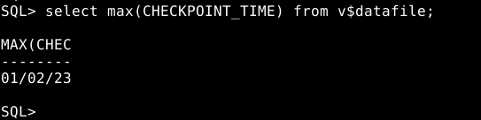

También podemos ejecutar esto para verlos todos:
```sql
select CHECKPOINT_TIME from v$datafile;
```
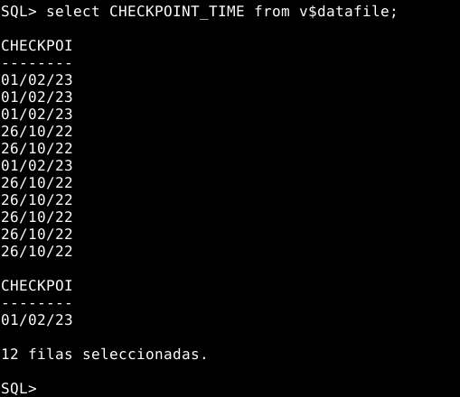

El proceso CKPT se ejecuta cuando se realiza un checkpoint en la base de datos. Este proceso se ejecuta cuando se realiza un commit o un rollback, cuando se realiza un backup o cuando se realiza un restore.

### 3. Intenta crear el tablespace TS1 con un fichero de 2M en tu disco que crezca automáticamente cuando sea necesario. ¿Puedes hacer que la gestión de extensiones sea por diccionario? Averigua la razón.

Sintaxis para crear un tablespace:
```sql
CREATE TABLESPACE nombre_tablespace
	DATAFILE 'ruta_archivo'
	SIZE tamaño_archivo
	AUTOEXTEND ON
	NEXT tamaño_extension
	MAXSIZE tamaño_maximo
	EXTENT MANAGEMENT LOCAL;
```
Para crear el tablespace TS1 con un fichero de 2M en mi disco que crezca automáticamente cuando sea necesario, ejecutaremos lo siguiente:
```sql
create tablespace TS1 datafile 'TS1.dbf' size 2M autoextend on extent management local;
```
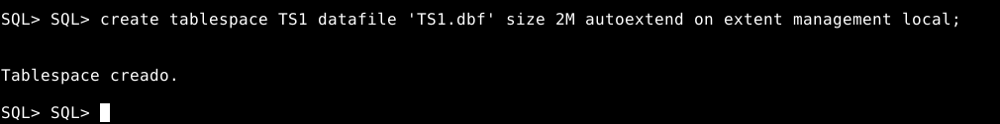

Para ver que se ha creado correctamente, ejecutaremos lo siguiente:
```sql
select FILE_NAME, TABLESPACE_NAME from dba_data_files;
```
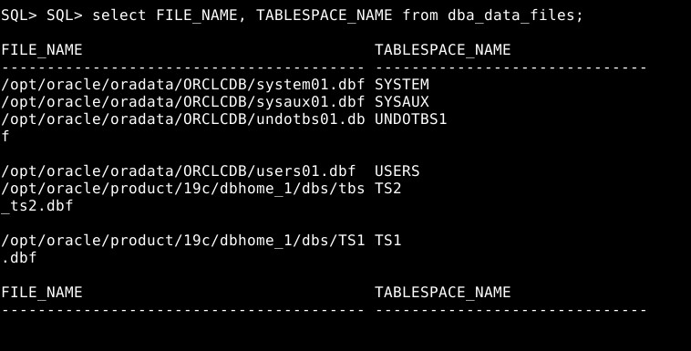

Si quisieramos que el tablespace se cree en otra ruta diferente, ejecutaríamos lo siguiente:
```sql
create tablespace TSPRUEBA datafile '/opt/oracle/oradata/ORCLCDB/TSPRUEBA.dbf' size 2M autoextend on extent management local;
```
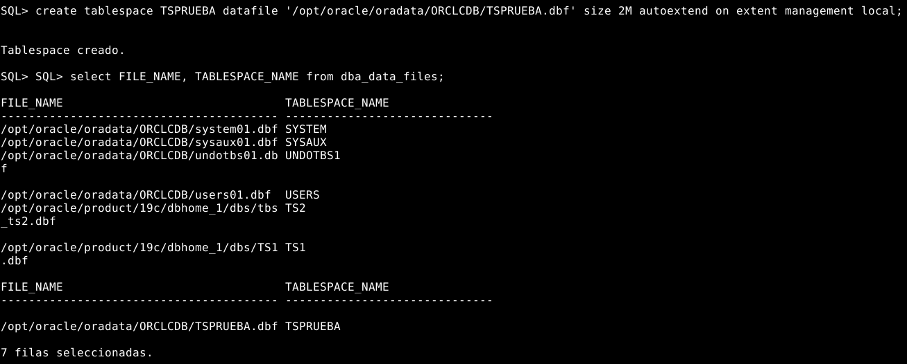

Como se puede ver, se ha creado en la ruta que le hemos indicado. La ruta donde se creó el TS2 '/opt/oracle/product/19c/dbhome_1/dbs/' es la ruta por defecto. Esta vez se creó en '/opt/oracle/oradata/ORCLCDB/'.

Para que la gestión de extensiones sea por diccionario, su sintaxis sería la siguiente:
```sql
CREATE TABLESPACE nombre_tablespace
    DATAFILE 'ruta_archivo'
    SIZE tamaño_archivo
    AUTOEXTEND ON
    NEXT tamaño_extension
    MAXSIZE tamaño_maximo
    EXTENT MANAGEMENT DICTIONARY;
```
Ejemplo:
```sql
create tablespace TS3 datafile 'TS3.dbf' size 2M autoextend on extent management dictionary;
```
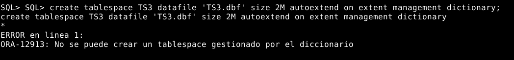

Para eliminar un tablespace, ejecutaremos lo siguiente:
```sql
drop tablespace `nombre` including contents and datafiles;
```

Como ya se dijo anteriormente, cuando se instaló Oracle, se instaló con la opción de que las extensiones se gestionen localmente.
Por lo tanto, no se puede cambiar a que la gestión de extensiones sea por diccionario, ya que el tablespace de SYSTEM se creó con la opción de que las extensiones se gestionen localmente y todos los tablespaces que se creen a partir de ese momento, heredarán esa opción. Y por último, el modo de extensión de un tablespace se establece al crear el tablespace. Una vez creado, no se puede cambiar el modo de extensión. Por lo tanto, si el tablespace TS1 se crea con modo de extensión automático, siempre se usará el modo de extensión automático. 

### 4. Averigua el tamaño de un bloque de datos en tu base de datos. Cámbialo al doble del valor que tenga.

Para averiguar el tamaño de un bloque de datos en mi base de datos, ejecutaré lo siguiente:
```sql
select value from v$parameter where name = 'db_block_size';
```
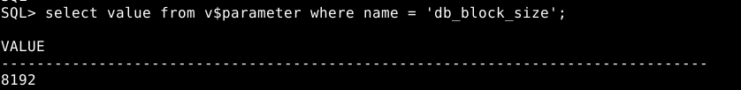

Con esto, he averiguado que el tamaño de bloque de datos en mi base de datos es de 8K.

En principio Oracle no permite la modificación del tamaño de bloque de un tablespace ya creado, por lo que nos disponemos a crear uno nuevo. Antes de crear dicho tablespace, vamos a modificar un valor del sistema para establecer el nuevo tamaño de bloque:
```sql
ALTER SYSTEM SET DB_16k_CACHE_SIZE=100M;
```
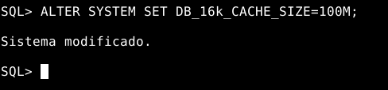

Después reiniciamos la base de datos para que se cargue la variable que hemos redefinido y creamos este nuevo tablespace.
```sql
shutdown;
startup
create tablespace prueba datafile '/home/oracle/test.img' size 1M blocksize 16K;
```
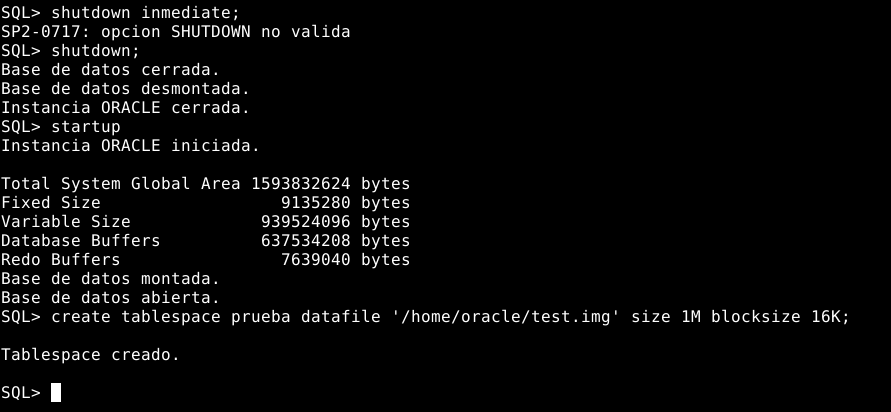

Y a continuación ejecutamos una consulta para verificar el tamaño de bloque.
```sql
select tablespace_name, block_size from dba_tablespaces where tablespace_name='PRUEBA';
```
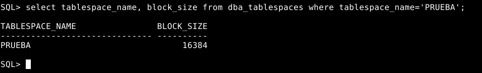

Como se puede ver, el tamaño de bloque es de 16K.

Para ver todos el tamaño de bloque de todos los tablespaces, ejecutaré lo siguiente:
```sql
select block_size, tablespace_name from dba_tablespaces;
```
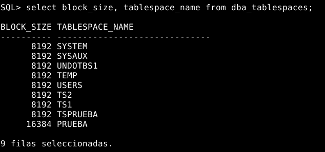

### 5. Realiza un procedimiento MostrarObjetosdeUsuarioenTS que reciba el nombre de un tablespace y el de un usuario y muestre qué objetos tiene el usuario en dicho tablespace y qué tamaño tiene cada uno de ellos.

Para poder ejecutar el procedimiento, primero debemos activar el modo de salida de datos del servidor:
```sql
set serveroutput on;
```

Procedimiento:
```sql
create or replace procedure MostrarObjetosdeUsuarioenTS(p_tsname VARCHAR2, p_user VARCHAR2)
is
	cursor c_userobjectsTS
	is
	select segment_name object, bytes
	from dba_segments
	where tablespace_name=p_tsname
	and owner=p_user;
begin
	dbms_output.put_line('OBJETOS DEL USUARIO: '||p_user||' | TAMANO (BYTES)');
	dbms_output.put_line('----------------------------------------------');
	for i in c_userobjectsTS loop
		dbms_output.put_line(i.object||chr(9)||chr(9)||chr(9)||chr(9)||i.bytes);
		dbms_output.put_line('----------------------------------------------');
	end loop;
end;
/
```

Comprobación:
- Usuario SCOTT
```sql
exec MostrarObjetosdeUsuarioenTS('USERS','SCOTT');
```
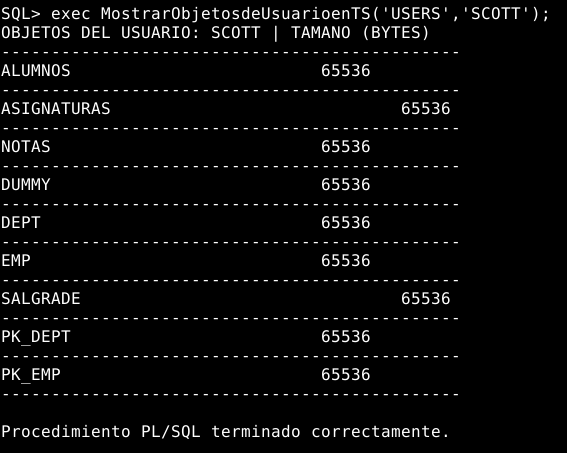

### 6. Realiza un procedimiento llamado MostrarUsrsCuotaIlimitada que muestre los usuarios que puedan escribir de forma ilimitada en más de uno de los tablespaces que cuentan con ficheros en la unidad C:

Para averiguar quiénes tienen una cuota ilimitada, necesitamos observar dos atributos; max_blocks y max_bytes. Si ambos valores son igual a -1, entonces el usuario tiene una cuota sin límites.

Para poder ejecutar el procedimiento, primero debemos activar el modo de salida de datos del servidor:
```sql
set serveroutput on;
```
	
Procedimiento:
```sql
create or replace procedure MostrarUsrsCuotaIlimitada
is
	cursor c_UsuarioSinCuota
	is
	select username nombre
	from DBA_TS_QUOTAS
	where max_blocks = -1
	and max_bytes = -1
	and tablespace_name in (select tablespace_name from DBA_DATA_FILES where substr(file_name,1,12) = '/home/oracle')
	group by username
	having count(tablespace_name) > 1
	UNION
	select grantee nombre
	from DBA_SYS_PRIVS
	where privilege = 'UNLIMITED TABLESPACE';
begin
	dbms_output.put_line('Usuarios con cuota ilimitada:');
	dbms_output.put_line('---------------------------');
	for usuario in c_UsuarioSinCuota loop
		dbms_output.put_line(usuario.nombre);
		dbms_output.put_line('---------------------------');
	end loop;
end;
/
```

Comprobación:
```sql
exec MostrarUsrsCuotaIlimitada;
```
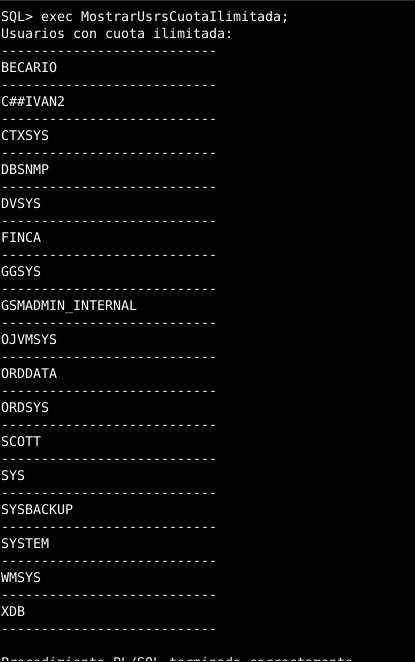

## Postgres:
       
### 7. Averigua si existe el concepto de tablespace en Postgres, en qué consiste y las diferencias con los tablespaces de ORACLE.

Postgres ofrece la posibilidad de crear tablespaces, que permiten una segmentación y distribución de los datos de manera física ubicándolos en distintos directorios. Esto aporta una mejora al sistema de almacenamiento de datos, ya que permite una mayor flexibilidad y escalabilidad. Por ejemplo, podemos ubicar los datos de acceso más concurridos en una unidad de disco estado sólido para mejorar el rendimiento

Sin embargo, presentan una funcionalidad bastante reducida respecto a la versión de Oracle. A continuación, explicaremos las diferencias entre ambos:

**Tablespaces en Oracle:**

**Tablespace permanente:** Un tablespace permanente es un contenedor lógico en una base de datos Oracle que almacena objetos de la base de datos, como tablas, índices y vistas. Estos objetos se almacenan físicamente como archivos en el sistema de archivos del servidor.

- Sintaxis de un tablespace permanente en Oracle:
```sql
CREATE
  [ SMALLFILE | BIGFILE ]
  TABLESPACE tablespace_name
  { DATAFILE { [ 'filename' | 'ASM_filename' ]
               [ SIZE integer [ K | M | G | T | P | E ] ]
               [ REUSE ]
               [ AUTOEXTEND
                   { OFF
                   | ON [ NEXT integer [ K | M | G | T | P | E ] ]
                   [ MAXSIZE { UNLIMITED | integer [ K | M | G | T | P | E ] } ]
                   }
               ]
             | [ 'filename | ASM_filename'
             | ('filename | ASM_filename'
                 [, 'filename | ASM_filename' ] )
             ]
             [ SIZE integer [ K | M | G | T | P | E ] ]
             [ REUSE ]
             }
     { MINIMUM EXTENT integer [ K | M | G | T | P | E ]
     | BLOCKSIZE integer [ K ]
     | { LOGGING | NOLOGGING }
     | FORCE LOGGING
     | DEFAULT [ { COMPRESS | NOCOMPRESS } ]
   storage_clause
     | { ONLINE | OFFLINE }
     | EXTENT MANAGEMENT
        { LOCAL
           [ AUTOALLOCATE
           | UNIFORM
              [ SIZE integer [ K | M | G | T | P | E ] ]
           ]
        | DICTIONARY
        }
     | SEGMENT SPACE MANAGEMENT { AUTO | MANUAL }
     | FLASHBACK { ON | OFF }
         [ MINIMUM EXTENT integer [ K | M | G | T | P | E ]
         | BLOCKSIZE integer [ K ]
         | { LOGGING | NOLOGGING }
         | FORCE LOGGING
         | DEFAULT [ { COMPRESS | NOCOMPRESS } ]
         storage_clause
         | { ONLINE | OFFLINE }
         | EXTENT MANAGEMENT
              { LOCAL
                [ AUTOALLOCATE | UNIFORM [ SIZE integer [ K | M | G | T | P | E ] ] ]
                | DICTIONARY
              }
         | SEGMENT SPACE MANAGEMENT { AUTO | MANUAL }
         | FLASHBACK { ON | OFF }
         ]
     }
```

**Tablespace temporal:** Un tablespace temporal es un contenedor lógico en una base de datos Oracle que almacena datos temporales, como los datos que se crean durante la ejecución de una instrucción SQL. Estos datos se almacenan como archivos en el sistema de archivos del servidor.

- Sintaxis de un tablespace temporal en Oracle:
```sql
CREATE
  [ SMALLFILE | BIGFILE ]
  TEMPORARY TABLESPACE tablespace_name
    [ TEMPFILE { [ 'filename' | 'ASM_filename' ]
                 [ SIZE integer [ K | M | G | T | P | E ] ]
                 [ REUSE ]
                 [ AUTOEXTEND
                     { OFF
                     | ON [ NEXT integer [ K | M | G | T | P | E ] ]
                     [ MAXSIZE { UNLIMITED | integer [ K | M | G | T | P | E ] } ]
                     }
                 ]
               | [ 'filename | ASM_filename'
               | ('filename | ASM_filename'
                   [, 'filename | ASM_filename' ] )
               ]
               [ SIZE integer [ K | M | G | T | P | E ] ]
               [ REUSE ]
               }
    [ TABLESPACE GROUP { tablespace_group_name | '' } ]
    [ EXTENT MANAGEMENT
       { LOCAL
          [ AUTOALLOCATE | UNIFORM [ SIZE integer [ K | M | G | T | P | E ] ] ]
       | DICTIONARY
       } ]
```

**Tablespace undo:** Un tablespace undo es un contenedor lógico en una base de datos Oracle que almacena información necesaria para restaurar la base de datos a un estado anterior si hay un error o un fallo durante la ejecución de una instrucción

- Sintaxis de un tablespace Undo en Oracle:
```sql
CREATE
  [ SMALLFILE | BIGFILE ]
  UNDO TABLESPACE tablespace_name
    [ DATAFILE { [ 'filename' | 'ASM_filename' ]
                 [ SIZE integer [ K | M | G | T | P | E ] ]
                 [ REUSE ]
                 [ AUTOEXTEND
                     { OFF
                     | ON [ NEXT integer [ K | M | G | T | P | E ] ]
                     [ MAXSIZE { UNLIMITED | integer [ K | M | G | T | P | E ] } ]
                     }
                 ]
               | [ 'filename | ASM_filename'
               | ('filename | ASM_filename'
                   [, 'filename | ASM_filename' ] )
               ]
               [ SIZE integer [ K | M | G | T | P | E ] ]
               [ REUSE ]
               }
    [ EXTENT MANAGEMENT
       { LOCAL
          [ AUTOALLOCATE | UNIFORM [ SIZE integer [ K | M | G | T | P | E ] ] ]
       | DICTIONARY
       } ]
    [ RETENTION { GUARANTEE | NOGUARANTEE } ]
```

**Tablespaces en PostgreSQL:**

- Sintaxis en PostgreSQL:

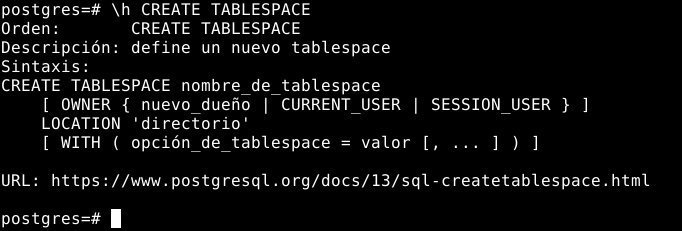

**Diferencias principales entre ambos gestores:**
- En Oracle se usan ficheros (datafiles) y en Postgres usamos directorios.
- Mientras que Oracle permite una definición más precisa de estos tablespaces, Postgres se queda un poco corto ya que ni siquiera podemos definir un tamaño máximo.
- Los tablespaces de Oracle tienen una mayor capacidad de control y administración, mientras que en Postgres su administración es más simplificada. 
- Oracle permite crear tablespaces temporales, lo cual no existe en Postgres. 
- Los tablespaces de Oracle tienen la capacidad de almacenar objetos como índices, tablas, vistas, procedimientos almacenados, etc. En Postgres, los tablespaces solo se usan para almacenar tablas.
- En Oracle los tablespaces se pueden crear en un disco local, en un disco compartido, en un disco externo, etc. En Postgres, solo se pueden crear en un disco local.


## MySQL:

### 8. Averigua si pueden establecerse claúsulas de almacenamiento para las tablas o los espacios de tablas en MySQL.

Sí, MySQL tiene un concepto de almacén de tablas para los datos de la base de datos. Esto permite almacenar los datos en diferentes ubicaciones físicas, lo que mejora el rendimiento y la escalabilidad. Los usuarios pueden crear uno o más almacenes de tablas para cada base de datos y asignar una tabla o espacio de tablas a un almacén particular.

Al momento de crear tablas, podemos seleccionar diversos parámetros para determinar características como la cantidad máxima de registros, la ubicación del archivo que almacenará la tabla, y si es necesario, también ofrece la opción de encriptar el contenido. 

A continuación, explicaremos brevemente cada uno de los parámetros que podemos establecer en MySQL.

- Sintaxis:
```sql	
help create table
```
```sql
table_option: 
 [STORAGE] ENGINE [=] engine_name
 | AUTO_INCREMENT [=] value
 | AVG_ROW_LENGTH [=] value
 | [DEFAULT] CHARACTER SET [=] charset_name
 | CHECKSUM [=] {0 | 1}
 | [DEFAULT] COLLATE [=] collation_name
 | COMMENT [=] 'string'
 | CONNECTION [=] 'connect_string'
 | DATA DIRECTORY [=] 'absolute path to directory'
 | DELAY_KEY_WRITE [=] {0 | 1}
 | ENCRYPTED [=] {YES | NO}
 | ENCRYPTION_KEY_ID [=] value
 | IETF_QUOTES [=] {YES | NO}
 | INDEX DIRECTORY [=] 'absolute path to directory'
 | INSERT_METHOD [=] { NO | FIRST | LAST }
 | KEY_BLOCK_SIZE [=] value
 | MAX_ROWS [=] value
 | MIN_ROWS [=] value
 | PACK_KEYS [=] {0 | 1 | DEFAULT}
 | PAGE_CHECKSUM [=] {0 | 1}
 | PAGE_COMPRESSED [=] {0 | 1}
 | PAGE_COMPRESSION_LEVEL [=] {0 .. 9}
 | PASSWORD [=] 'string'
 | ROW_FORMAT [=]
{DEFAULT|DYNAMIC|FIXED|COMPRESSED|REDUNDANT|COMPACT|PAGE}
 | SEQUENCE [=] {0|1}
 | STATS_AUTO_RECALC [=] {DEFAULT|0|1}
 | STATS_PERSISTENT [=] {DEFAULT|0|1}
 | STATS_SAMPLE_PAGES [=] {DEFAULT|value}
 | TABLESPACE tablespace_name
 | TRANSACTIONAL [=] {0 | 1}
 | UNION [=] (tbl_name[,tbl_name]...)
 | WITH SYSTEM VERSIONING
```
```sql
partition_options:
 PARTITION BY
 { [LINEAR] HASH(expr)
 | [LINEAR] KEY(column_list)
 | RANGE(expr)
 | LIST(expr)
 | SYSTEM_TIME [INTERVAL time_quantity time_unit] [LIMIT
num] }
 [PARTITIONS num]
 [SUBPARTITION BY
 { [LINEAR] HASH(expr)
 | [LINEAR] KEY(column_list) }
 [SUBPARTITIONS num]
 ]
 [(partition_definition [, partition_definition] ...)]
```
```sql 
partition_definition:
 PARTITION partition_name
 [VALUES {LESS THAN {(expr) | MAXVALUE} | IN (value_list)}]
 [[STORAGE] ENGINE [=] engine_name]
 [COMMENT [=] 'comment_text' ]
 [DATA DIRECTORY [=] 'data_dir']
 [INDEX DIRECTORY [=] 'index_dir']
 [MAX_ROWS [=] max_number_of_rows]
 [MIN_ROWS [=] min_number_of_rows]
 [TABLESPACE [=] tablespace_name]
 [NODEGROUP [=] node_group_id]
 [(subpartition_definition [, subpartition_definition] ...)]
```
```sql
subpartition_definition:
 SUBPARTITION logical_name
 [[STORAGE] ENGINE [=] engine_name]
 [COMMENT [=] 'comment_text' ]
 [DATA DIRECTORY [=] 'data_dir']
 [INDEX DIRECTORY [=] 'index_dir']
 [MAX_ROWS [=] max_number_of_rows]
 [MIN_ROWS [=] min_number_of_rows]
 [TABLESPACE [=] tablespace_name]
 [NODEGROUP [=] node_group_id]
```

Aunque podemos definir una tabla en MySQL, no se puede contar con la funcionalidad de tablespaces en condiciones comunes. Para tener esta característica, se requiere la versión de alta disponibilidad en cluster de MySQL, la cual es conocida como MySQL NDB. 

En este caso la sintaxis a la hora de crear los tablespaces es la siguiente:
```sql
CREATE TABLESPACE tablespace_name

  InnoDB and NDB:
    ADD DATAFILE 'file_name'

  InnoDB only:
    [FILE_BLOCK_SIZE = value]

  NDB only:
    USE LOGFILE GROUP logfile_group
    [EXTENT_SIZE [=] extent_size]
    [INITIAL_SIZE [=] initial_size]
    [AUTOEXTEND_SIZE [=] autoextend_size]
    [MAX_SIZE [=] max_size]
    [NODEGROUP [=] nodegroup_id]
    [WAIT]
    [COMMENT [=] 'string']

  InnoDB and NDB:
    [ENGINE [=] engine_name]
```

MySQL NDB utiliza un sistema de almacenamiento en memoria distribuido y altamente escalable para ofrecer una alta disponibilidad y rendimiento. El sistema es capaz de manejar altas cargas de trabajo y escalar con facilidad. Además, permite la replicación de datos para mejorar la disponibilidad de los mismos. Esta característica es muy útil para entornos de producción donde el acceso a los datos es crítico. MySQL NDB es una solución eficiente para las empresas que requieren una base de datos escalable y segura para satisfacer sus necesidades de almacenamiento.

En cuanto a MariaDB, se ha eliminado completamente NDB (MySQL Cluster) de MariaDB 10.1. Desde MariaDB 10.0 y versiones anteriores, estaba deshabilitado debido a que no se incluía en las principales versiones de MySQL. El código original tiene NDB disponible como descarga separada, ya que Cluster se actualiza con mayor frecuencia en comparación con la versión base de MySQL.

## MongoDB:

### 9. Averigua si existe el concepto de índice en MongoDB y las diferencias con los índices de ORACLE. Explica los distintos tipos de índice que ofrece MongoDB.

En MongoDB hay varias opciones para trabajar con índices, dependiendo de cómo deseemos que se comporten (es decir, si queremos que se apliquen a uno o más campos, si queremos que el orden sea ascendente o descendente, etc). En cambio, con Oracle contamos con otros tipos de índices y opciones.

**Tipos de índices en MongoDB:**

- Simples: Los criterios de ordenación se aplican a una sola categoría determinada, y se usa el valor 1 o -1 para indicar si la ordenación se hace de forma ascendente o descendente, respectivamente.
```sql
db.empleados.createIndex( { "nombre" : 1 } )
```

- Compound: Los operadores lógicos se emplean para trabajar con dos o más valores, y tienen un comportamiento similar al de los operadores sencillos. Esto nos permite especificar la dirección de búsqueda que queremos seguir para cada campo.
```sql
db.empleados.createIndex( { "nombre" : 1, "salario": -1 } ) 
```

- Multikey: Los índices multikey de MongoDB se emplean para indexar contenido almacenado en arrays. Esto permite que MongoDB solo recorra aquellos documentos cuyos arrays contienen uno de los valores especificados. Crear este tipo de índices es fácil, ya que se realiza automáticamente al usar el método createIndex. Esto evita que tengamos que realizar el proceso manualmente para asegurarnos de que solo se recorren los arrays especificados.
```sql
db.empleados.createIndex( { "salario" : 1 } )
```

- Unique: Se emplean para remover los campos que se repiten, algo similar a cuando realizamos una select distinct en Oracle.
```sql
db.empleados.createIndex( { "salario" : 1 }, {"unique":true} )
```
    
- TTL Indexes: No es un índice en el sentido tradicional, ya que estamos especificando el tiempo de caducidad de un documento basado en un campo de éste. La documentación de Mongo muestra cómo los documentos en la colección eventlog se borrarían si no se modificasen durante una hora.
```sql
db.eventlog.createIndex( { "lastModifiedDate": 1 }, { expireAfterSeconds: 3600 } )
```

**Tipos de índices en Oracle:**

- Table Index:
```sql
CREATE [UNIQUE|BITMAP] INDEX [esquema.]index_name
      ON [esquema.]table_name [tbl_alias]
         (col [ASC | DESC]) index_clause index_attribs
```

- Cluster Index:
```sql
CREATE [UNIQUE|BITMAP] INDEX [esquema.]index_name
      ON CLUSTER [esquema.]cluster_name index_attribs	
```

- Bitmap Join Index:
```sql
CREATE [UNIQUE|BITMAP] INDEX [esquema.]index_name
      ON [esquema.]table_name [tbl_alias]
         (col_expression [ASC | DESC])
            FROM [esquema.]table_name [tbl_alias]
               WHERE condition [index_clause] index_attribs
```

- Las index_clauses son las siguientes:
```sql
LOCAL STORE IN (tablespace)

LOCAL STORE IN (tablespace)
  (PARTITION [partition
       [LOGGING|NOLOGGING]
       [TABLESPACE {tablespace|DEFAULT}]
       [PCTFREE int]
       [PCTUSED int]
       [INITRANS int]
       [MAXTRANS int]
       [STORAGE storage_clause]
       [STORE IN {tablespace_name|DEFAULT]
       [SUBPARTITION [subpartition [TABLESPACE tablespace]]]])

LOCAL (PARTITION [partition
       [LOGGING|NOLOGGING]
       [TABLESPACE {tablespace|DEFAULT}]
       [PCTFREE int]
       [PCTUSED int]
       [INITRANS int]
       [MAXTRANS int]
       [STORAGE storage_clause]
       [STORE IN {tablespace_name|DEFAULT]
       [SUBPARTITION [subpartition [TABLESPACE tablespace]]]])

GLOBAL PARTITION BY RANGE (col_list)
   ( PARTITION partition VALUES LESS THAN (value_list)
       [LOGGING|NOLOGGING]
       [TABLESPACE {tablespace|DEFAULT}]
       [PCTFREE int]
       [PCTUSED int]
       [INITRANS int]
       [MAXTRANS int]
       [STORAGE storage_clause] )

INDEXTYPE IS indextype [PARALLEL int|NOPARALLEL] [PARAMETERS ('ODCI_Params')]
 {Esto es solo para table index, no para bitmap join Index}
```

Por último, además index_attribs puede ser cualquier combinación de los siguientes:
```sql
NOSORT|SORT
REVERSE
COMPRESS int
NOCOMPRESS
COMPUTE STATISTICS
[NO]LOGGING
ONLINE
TABLESPACE {tablespace|DEFAULT}
PCTFREE int
PCTUSED int
INITRANS int
MAXTRANS int
STORAGE storage_clause
PARALLEL parallel_clause
```
