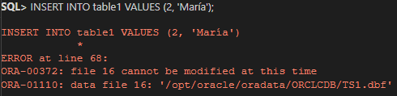
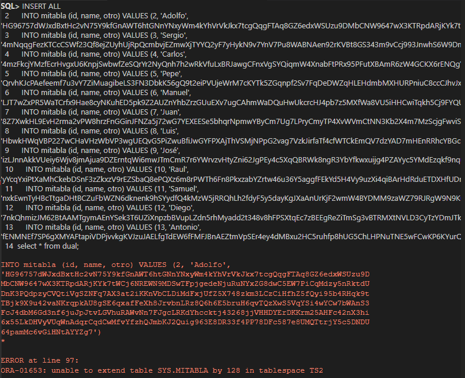
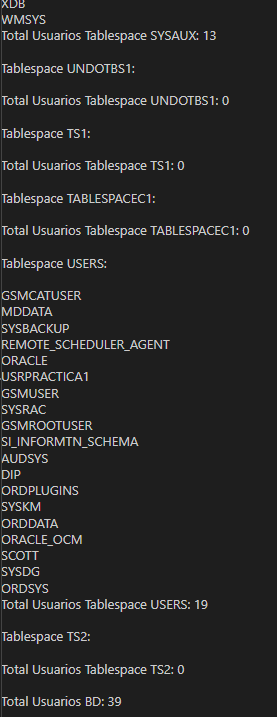
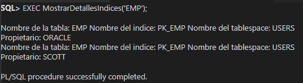

## Alumno 2:

### ORACLE:

**1. Establece que los objetos que se creen en el TS1 (creado por Alumno 1) tengan un tamaño inicial de 200K, y que cada extensión sea del doble del tamaño que la anterior. El número máximo de extensiones debe ser de 3.**

--Modificación

```sql
ALTER TABLESPACE TS1
Modify DATAFILE '/opt/oracle/oradata/ORCLCDB/TS1.dbf' 
SIZE 200K
AUTOEXTEND ON
NEXT 400K
MAXSIZE 1600K;


ALTER TABLESPACE TS1
DEFAULT STORAGE 
(INITIAL 200K 
NEXT 400K
MINEXTENTS 1 
MAXEXTENTS 3);
```

--Creación de nuevo tablaspace

```sql
CREATE TABLESPACE TS1 
DATAFILE '/opt/oracle/oradata/ORCLCDB/TS1.dbf' 
SIZE 200K 
AUTOEXTEND ON 
NEXT 400K 
MAXSIZE 1600K
EXTENT MANAGEMENT LOCAL;
```

**2. Crea dos tablas en el tablespace recién creado e inserta un registro en cada una de ellas. Comprueba el espacio libre existente en el tablespace. Borra una de las tablas y comprueba si ha aumentado el espacio disponible en el tablespace. Explica la razón.**

```sql
CREATE TABLE table1 (
    id NUMBER, 
    name VARCHAR2(30)) 
    TABLESPACE TS1;

INSERT INTO table1 VALUES (1, 'John');

CREATE TABLE table2 (
    id NUMBER, 
    address VARCHAR2(50)) 
    TABLESPACE TS1;

INSERT INTO table2 VALUES (1, '123 Main St');

SELECT TABLESPACE_NAME, BYTES/1024/1024 MB, MAXBYTES/1024/1024 MAX_MB FROM DBA_DATA_FILES
WHERE  TABLESPACE_NAME = 'TS1';

DROP TABLE table2;
```

- El espacio disponible en el tablespace no aumenta de inmediato después de borrar la tabla, ya que Oracle mantiene los bloques de datos asignados a la tabla hasta que sean reutilizados por otros objetos.

**3. Convierte a TS1 en un tablespace de sólo lectura. Intenta insertar registros en la tabla existente. ¿Qué ocurre?. Intenta ahora borrar la tabla. ¿Qué ocurre? ¿Porqué crees que pasa eso?**

```sql
ALTER TABLESPACE TS1 READ ONLY;

INSERT INTO table1 VALUES (2, 'María');

DROP TABLE table1;
```

- Al intentar insertar un registro, dará un error porque no es posible realizar operaciones de escritura en un tablespace de sólo lectura.



- Al intentar borra una tabla 

**4. Crea un espacio de tablas TS2 con dos ficheros en rutas diferentes de 1M cada uno no autoextensibles. Crea en el citado tablespace una tabla con la clausula de almacenamiento que quieras. Inserta registros hasta que se llene el tablespace. ¿Qué ocurre?**

Al intentar insertar mas registro da error porque no puede generar mas extensiones.

```sql
CREATE TABLESPACE TS2
DATAFILE '/opt/oracle/oradata/ORCLCDB/file1.dbf'
SIZE 1M
AUTOEXTEND OFF;

ALTER TABLESPACE TS2
ADD DATAFILE '/opt/oracle/oradata/ORCLCDB/file2.dbf'
SIZE 1M
AUTOEXTEND OFF;

CREATE TABLE mitabla (id number, name varchar2(30), otro VARCHAR2(500))
TABLESPACE TS2
STORAGE (INITIAL 100K NEXT 100K);

INSERT ALL
    INTO mitabla (id, name, otro) VALUES (2, 'Adolfo', 'HG96757dWJxdBxtHc2vN75Y9kfGnAWT6htGNnYNxyWm4kYhVrVkJkx7tcgQqgFTAq8GZ6edxWSUzu9DMbCNW9647wX3KTRpdARjKYk7tWCj6NREWN9MDSwTFpjgedeNjuRuNYxZG8dwC5EW7PiCqMdzy5nRktdUDnK3PQdpzyCVQtiVgSZNFq7AX3at2iKKnVbCLDiMdFxjUfZ5X748zkm3LCzCiHfhZ5fQyi95b4RHqk9tTBjk9X9u42vaNKrqpkAU8gSE6qxafFeXh8JrvbnLRz8Q6h6E5bruH6qvTQzXwS5VqYSi4wYCw7bWAnS3FcJ4dbM6Gd3nf6juJpJtvLGVhuRAWvNn7FJgcLRKdYhccktj43268jjVHHDYErDKKrm25AHFc42nX3hi6x55LkDHVyVUqWnAdqrCqdCwMfvYfzhQJmbKJ2Quig963E8DR33f4PP78DFc587e8UMQTtrjY5c5DNDU64pamMc6vGiHNtAYYZg7') 
    INTO mitabla (id, name, otro) VALUES (3, 'Sergio', '4mNqqgFezKTCcCSWf23Qf8ejZUyhUjRpQcmbvjEZmwXjTYYQ2yF7yHykN9v7YnV7Pu8WABNAen92rKVBt8GS343m9vCcj993JnwhS6W9DmQ8gmrqzUTVQmhZxiX8gBtz4SC2zAwUDC5hq9bvjU4qSKrNxLQyRFdHFunbGUNwrXQDhYEmn6JNT3xMARzzRFFxVrxp53PRrEk4dgVr9YrX637yha7WW45S8wAYcYMVePXeHGEFfjR6m7HyJPd5RqKGUNT6aZyXZGiA9wGG9RjZFeC4g4eu6ia5W6QAeDz5dmib9h4g5hiE8gAXZ6RKepPhwPixq9UD457G2yHTZAiAnB9z8Ah94nvTzPARiE3jgtuX6bQWJkQNbSUTE7rMbmkfiD24MPLDmYyype5GxmvUJ2cKPdryHm6k9rgP4RXfazKdVmHnZjLwHf5WMAM4UJkKCgrj4VQudv4iRxN4KFa62ZKfMS3uST83z5dtZmpGq8YXYt734WQ') 
    INTO mitabla (id, name, otro) VALUES (4, 'Carlos', '4mzFkcjYMzfEcrHvgxU6KnpjSwbwfZeSQrYr2NyQnh7h2wRkVfuLxBRJawgCFnxVgSYQiqmW4XnabFtPRx95PFutXBAmR6zW4GCKX6rENQgYKAr4RUgXSKzJD884gizJUwWGhrNN84c9U9vnA8Gq7KBVmu4EEL6b9a7DxLzcUWnECfRbgVymCbc8JxiPicxMEVSAhRFgu3pkptWMSgyJ479aVVErAcyhGvGYhgJejTDL9zp5VvA2xDku2EBrQhhN8Fn6jA9UraRL8eVw4ifukuMqCtWQyKQiwgucrmUTggbbMe3SAc66Ug8i69ujGUJ4cQgbfM3LZSv29V38WY4kdgFJmiZ3FG9JUnQ3UGpuFAjPJGmmF8AyU8Jc7MPMfTqvm6TZCGUS4LkHRRDpPLPB2PXFvxyfqBZYbghZHWugm7DSgSFGwxSEWRh4hgKDbNcGhhhGcCRDVjG935B3uPXGhGyhbvBXn5rEXPwUJkwtbRn68T4SHTw') 
    INTO mitabla (id, name, otro) VALUES (5, 'Pepe', 'QrvhKJcPAefeemf7u3vY7ZiMuagibeLS3FN3DbkK56gQ9t2eiPVUjeWrM7cKYTk5ZGqnpf2Sv7FqDeDWZqHLEHdmbMXHURPniuC8ccCJhvJxUbmKp2xHEubUYaXc9zQx97dtve2UVF4Uw838HUyTdqSPqTC9B8XpT6QJdBpmB3Uyvvvx8Wg3Vu4w4mXVUzCy5xmGFrvNeLGLuF9tnzYTpQFbJVNqbEeaDqmCw6DizwUk7xgfaGuLnv3gPEtVX9FN2ZdHyy5WMaChDNAbiKLJEUkLFxqPHjN65DD8R4i4gJpJfdhZaCjxZ7cZFLDY4WWx5UYEQBkePwTnLTavvzfeUqdafMrHduNQyu4gD4YVPQ8F4ND4qRFkTQ2NWgba3frUjtVM4WSrEvrkxPwM5V3hbfwFcTXW7mvAQc4zHRyuyEWGp28i2MgapXnMWPXUiKXJkQfbwVkabZh6BcXZvaLCzA2XWwVSdanXGXzuCVjgtRycgRjyZke') 
    INTO mitabla (id, name, otro) VALUES (6, 'Manuel', 'LJT7wZxPR5WaTCrfx9Hae8cyNKuhED5pk9Z2AUZnYhbZrzGUuEXv7ugCAhmWaDQuHwUkcrcHJ4pb7z5MXfWa8VU5iHHCwiTqkh5Cj9FYQUtGUBiHSfeYEEePpiqwX73vGwLTJHGmG4H7zaBLMR6NHFMyy79PhLh8KC5TPSjxT5E6JanjCLKE3VEiDpHJDz6JNVmVAcDmZhSD3utZbXRBSfxt5bpMuD6DxV36v3JJfxdninLPchkuYErKnmPMBzuvMTFJSFnRjcwhfAvfNPpQ39N29XBB6qCgAWHcjipQCuw5iZGyHx64VGBii8whywVmw9a6AMJp4qCpkb3LvaJXqf93AcgYZUrzJYQQmGkK6MpJAmjcftuimSwHAPm8QKvjuVRwMpFtVZbLNNTTPAdXqPjjEMEe3HjG6FFN38WBDzNHqiD9JikXkbJQPAH6vUNJt4RTxKPjHyEvT5WPLdzPxPjB6emE2B8M9HBAJXS4BQcvy8BJQRX') 
    INTO mitabla (id, name, otro) VALUES (7, 'Juan', '8Z7XwkHL9EvH2rma2vPW8hrzFnGGinJFNZa5j72wG7YEXEESe5bhqrNpmwYByCm7Ug7LPryCmyTP4XvWVmCtNN3Kb2X4m7MzScjgFwviS2wK5gYAVFMbKKW83LUCK3ck5xrC2Y45D8ybfYgcm64CqS32YBVxANqQRp9njiWAF7BrrY9nkRbUzf94grDkXwDVfQjCSUuZpVNtBCwYZdxK6X7FVMnbxTgZd73VErgGCqX6aChfJDCMiZEP4Sry8WAGdCY8dpgXB2t4F9pTGSuPn3b3kxW7vk7QcUwDT7Y7RWMYKdqvvJ3MPJ95exfiVGmh4bTgEVgnG6iVyvNfVKEv732ZR5DKAz2wxeaQJnzuvVd8PtKhgPmWheRZHPBCvbb8PbxAEVdCCQUzdLwJvnCaMPRP698XAaLJZgSMLimj59bcrxV7VjXmzDzjirevBAaRQSKvqXTyTEhYttYx5FcEzbRq8nxDvWTzYXnX8kpF4E7kPJKr5D6') 
    INTO mitabla (id, name, otro) VALUES (8, 'Luis', 'HbwkHWqVBP227wCHaVHzWbVP3wgUEQvG5PiZwuBfiJwGYFPXAjThVSMjNPpG2vag7VzkJirfaTf4cfWTCkEmQV7dzYAD7mHEnRRhcYBGcUnDxEWLSXHbFbLRmHdEEXCpiDPqfqV99NpA7pCcMxUzpqkN7bkgXm7ytqAkqPqZSAFTMtzpnB72yXPEDkjwwjqFDQuYnPp2NnMahu4gL7t8CUtaqWGMQ9rE3qeZetDJ3x7XGFiCTZBjjtbF9dvWdNt7wKASFBFSzeNb2ALhF2Y5z5qxECdnQdiMKqydPh6RfV7cp6m7mJigpNdTK42djKqrTKHSTjREX3q8CE3ncG3YxB7KhFZ7xY4Vu3mgHt7BXidgWmgEFPPZjfEPfUyQnxqyrC5ggKHnqJUMmGHF7fNeTLVAjfP5A9Dyz7cKPhywYvwnGkYv5ekVNHrXgKvin3UQTxx8Bj7kavhX23rHpAmRx8HMexbzTkMWm8XwGTp5Tx2NnMxUGL4') 
    INTO mitabla (id, name, otro) VALUES (9, 'José', 'izLJnnAkkVUeiy6Wjv8jmAjua9DZErntqWi6mwJTmCmR7r6YWrvzvHtyZni62JgPEy4c5XqQBRWk8ngR3YbYfkwxuijg4PZAYyc5YMdEzqkf9nquVCuyXMqEQ2p35zb92j3hFWVJ7UWBV6NiXX9iZAVafKwXhYd5peYDMVT9PYb5ATDKj2aFAE4Rur62v3wTZGyrZcgGhtya46DcWkqXVUMxb2zu53ujkchFTgaqmQxCw8gziDPLvgAF26yJSpgSk4FFeqUuUJBHdNpFGZAQRUzdXvbvZTxBCJLrrGFdJWVSFmSbuMP2z6yLQqkq4PVmA7YzKPUhpStaytymGAivNTz4dzHYGaBNf9UBUGc2j4tMnnYMGuwBhq53cRUc93CrudJ7pmjh5LqmnLzZWNRkteQrtQJn6AAfSV4BMErkhJqGxwwauYm89DTmUNSQ7P4w8VpJEfVuKzdeGynSF9A3JmKLyyFd7BeKCQvAYke3rTy6gyecziM') 
    INTO mitabla (id, name, otro) VALUES (10, 'Raul', 'yYcqYxiPtXaMhCkebDSnF3zZkxzV9rEZSbaQ8ePQXz6m8rPWTh6Fn8PkxzabYZrtw46u36Y5aggfFEkYd5H4Vy9uzXi4qiBArHdRduETDXHfUDnzmX5XngW89QiHfH5fax3x9RYxLTuPa4PUkSDDAzkqtdnhgj8FriHdeRUcCGTpkbDXYXxnhbjTTGUQ3jJu36r7kbBBQP5ShTMwQ7urFUxeQYHeJyy5EVNP4S8ENkn4M2B9VAJkSi9z5f3v94cMqYYzFnk6wgximc9F99n7muvmw7LywqdcdE8HaGVijL268wgCGxRL6iGwLmuCzAHfy4rb4kkiJqVtpuL6K92JUAc5iHQ2eZWAj8HMj9E7n3EpjTGeiABbgCda7KmXKA4pfYvQ3EpnwJFK42fWJGUXHbWHKFjPrWmFnQmgdHe9a5Z92ciW9KivntqLR5yyf6v5TG6W3DBQt3qmZwXdBUS4htFpUCVQ8LrahPvwv7gu6rgDxBegLrw') 
    INTO mitabla (id, name, otro) VALUES (11, 'Samuel', 'nxkEwnTyHBcTtgaDHtBCZuFbWZN6dknenk9hSYydfQ4kMzW5jRRQhLh2fdyF5y5dayKgJXaAnUrKjF2wmW4BYDMM9zaWZ79RJRgW9N9KuaHcrN7crzp3eFAp8fL6fgx2E5xQXkD55ffn4cPkaTKPPu8MKfbagtKi54jMweVWfqxGeAdJVQ7PCdgMvmiDLRXfup3rYadKt3uDQPcWEDtaSrSpAdUhuUr2yMqDzYVwjh4M2Vf9vDHu2VJQ3RjBTJm9dp3uuJ7ppyi6FTEm7KS3bXU27QvMQaqHV9GW9xpaNMZGdWQdaWyDvUcYhNTVWtyVGFvqJaPS8HJE8mmStfLCxaMcPBS8izyKjNyykwmffHQfviJApRv9WM5CfVLUe4CbPAiL56RQDpRrxpBmwaEmepHRkGZCUHZXhB52Q9H3UPJU63PbFqrzYSXK6mZ9A64ynJWBhihZrhKqjywFFHRK6LYAVNpqfZmSZpZ37E4jk2ShqnWwjUh') 
    INTO mitabla (id, name, otro) VALUES (12, 'Diego', '7nkQhmizJM62BtAAMTgymAEnYSek3T6UZiXnpzbBVupLZdn5rhMyadd2t348v8hFPSXtqEc7zBEEgReZiTmSg3vBTRMXtNVLD3CyTzYDmJTkFwe99KRyk8dkxSuDtr5UBxkuY9yhdDT3GWaxDQ25J2ip7zGMYLeQD6V5iF6RUWu8jjQ2qrBqaN73UXam8Bpt9f2brTfeySbtpYgbMG2MBrGBiH3Q3mhVER7qrfYva53AL5RSF7qbapewezGnCN3gPGGEDC8tmyn83CGtT24TqSy7gkAAmKUfvXwUixd3jJpdwyGBymz47fDnSGUtM4V82VYJRTbEmZ9AFqgmYmB48FCpPtCpLaAcVvjYgTA4D7SffDq3KiYyxRKbWNrnyPdFnS76HNEy8WT6rErShhGN7etgPazGJYrvhcHMnWSFiwmn6Q9VaaAmaDKSHZ2itBS5kRBCD3y8Yg66fM7D27hTa73vM6p8dUVjTQyfp8Fbcgnub6iB8wJ') 
    INTO mitabla (id, name, otro) VALUES (13, 'Antonio', 'fENMNEf7SP6gXMYAFtapiVDPjvvkgKVJzuJAELfgTdEW6fFMFJBnAEZtmVpSEr4ey4dMBxu2HC5ruhfp8hUG5ChLHPNuTNE5wFCwKP6KYurQFzdewdqvbcN4nVEmCBaC3m9UMJcrveYAJvT2Pze3288iXzmamdbBKKkrvXypWNTjXqBDeCyeCpQKVMBP5cADttWMeKez6G59SyznXtTairGFXDtSz5HA2frdEjpBGdtmfpUdkuxKNAkC24a8md2DaciC7LjAPPEiHVr2xQgWz28SjLwKMQ72NrQtdewY5TviHckb6rYiPzWMdWKr8HL9SBb3XUThFNXAqZbenbt3ayT9rDQpgWayu3hcXkx5mDSPX5YEdB7QFUiTqmuEZUgkZj2CqhaCQbUJjMDciNk7PYagk6fMu9cWZ7SPATw7xypBdBeFfqAX98fngLX5MfGJ2ZZHzbMiw9MJYkMj9ZeXGvyUSxcYqv5WDnFYiKKwGLjPt8JMgk3')
select * from dual;
```



**5. Hacer un procedimiento llamado MostrarUsuariosporTablespace que muestre por pantalla un listado de los tablespaces existentes con la lista de usuarios que tienen asignado cada uno de ellos por defecto y el número de los mismos, así:**

```
--Tablespace xxxx:

--	Usr1
--	Usr2
--	...

--Total Usuarios Tablespace xxxx: n1

--Tablespace yyyy:

--	Usr1
--	Usr2
--	...

--Total Usuarios Tablespace yyyy: n2
--....
--Total Usuarios BD: nn

--No olvides incluir los tablespaces temporales y de undo.
```
```plsql
CREATE OR REPLACE PROCEDURE MostrarUsuariosPorTablespace
is
   CURSOR c_tablespaces IS
      SELECT distinct tablespace_name
      FROM dba_segments;
   CURSOR c_usuarios (p_tablespace_name VARCHAR2) IS
      SELECT username
      FROM dba_users
      WHERE default_tablespace = p_tablespace_name;
   v_tablespace_name VARCHAR2(30);
   v_usuario VARCHAR2(30);
   v_total_usuarios INTEGER := 0;
   v_total_usuarios_db INTEGER := 0;
BEGIN
   FOR r_tablespaces IN c_tablespaces LOOP
      v_tablespace_name := r_tablespaces.tablespace_name;
      DBMS_OUTPUT.PUT_LINE('Tablespace ' || v_tablespace_name || ':');
      DBMS_OUTPUT.PUT_LINE(' ');
      v_total_usuarios_db := v_total_usuarios_db + v_total_usuarios;
      v_total_usuarios := 0;
      FOR r_usuarios IN c_usuarios (v_tablespace_name) LOOP
         v_usuario := r_usuarios.username;
         DBMS_OUTPUT.PUT_LINE('  ' || v_usuario);
         v_total_usuarios := v_total_usuarios + 1;
      END LOOP;
      DBMS_OUTPUT.PUT_LINE('Total Usuarios Tablespace ' || v_tablespace_name || ': ' || v_total_usuarios);
      DBMS_OUTPUT.PUT_LINE(' ');
   END LOOP;
   DBMS_OUTPUT.PUT_LINE('Total Usuarios BD: ' || v_total_usuarios_db);
END;
/
```

```plsql
EXEC MostrarUsuariosPorTablespace;
```



**6. Realiza un procedimiento llamado MostrarDetallesIndices que reciba el nombre de una tabla y muestre los detalles sobre los índices que hay definidos sobre las columnas de la misma.**

```plsql
create or replace procedure MostrarDetallesIndices(p_tabla VARCHAR2) 
is 
   v_nomindice VARCHAR2(50); 
   v_nomtablespace VARCHAR2(50); 
   v_propietario VARCHAR2(50); 
   CURSOR c_cursor is select index_name, table_name, tablespace_name, owner 
   from dba_indexes where table_name=p_tabla; v_cursor c_cursor%ROWTYPE; 
begin 
   for v_cursor in c_cursor loop v_nomindice:=v_cursor.index_name; 
      v_nomtablespace:=v_cursor.tablespace_name; 
      v_propietario:=v_cursor.owner; 
      dbms_output.put_line('Nombre de la tabla: '||p_tabla||' Nombre del indice: '||v_nomindice||' Nombre del tablespace: '||v_nomtablespace||' Propietario: '||v_propietario);
   end loop; 
end; 
/
```

```plsql
EXEC MostrarDetallesIndices('EMP');
```



### Postgres:

**7. Averigua si existe el concepto de segmento y el de extensión en Postgres, en qué consiste y las diferencias con los conceptos correspondientes de ORACLE.**

- En postgresql, un segmento es el archivo/s que se crean al crear un tablespace, en Oracle es un grupo de bloques de disco. El concepto de extensión no existe en postgresql.

### MySQL:

**8. Averigua si existe el concepto de espacio de tablas en MySQL y las diferencias con los tablespaces de ORACLE.**

- Sí, existe el concepto de espacio de tablas en MySQL. Oracle permite múltiples tipos de tablespaces, como de sistema, de usuario, temporales y de gestión de recuperación, mientras que MySQL solo admite tablas fraccionadas.

### MongoDB:

**9. Averigua si existe la posibilidad en MongoDB de decidir en qué archivo se almacena una colección.**

- En mongodb no es posible decidir en qué archivo se almacena una colección.
