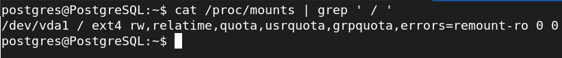

# Alumno 3 (Alfonso Roldán Amador):
## ORACLE:

### 1. Muestra los objetos a los que pertenecen las extensiones del tablespace TS2 (creado por Alumno 2) y el tamaño de cada una de ellas.

Replicaremos el proceso de creación del tablespace TS2 tal y como hizo el alumno 2 (2 ficheros en rutas diferentes de 1M cada uno no autoextensibles). Posteriormente insertaremos los registros hasta llenar el tablespace.

Con la siguiente consulta obtendremos los segmentos, id de extensión y tamaño del tablespace TS2:

```sql
SELECT SEGMENT_NAME, EXTENT_ID, BYTES FROM DBA_EXTENTS WHERE TABLESPACE_NAME = 'TS2';
```


### 2. Borra la tabla que está llenando TS2 consiguiendo que vuelvan a existir extensiones libres. Añade después otro fichero de datos a TS2.

Para borrar la tabla que está llenando TS2 podemos usar **"Truncate table"**. Con esto se eliminará la tabla y además se liberará espacio en el disco:

```sql
TRUNCATE TABLE nombre_tabla;
```


Posteriormente añadimos otro fichero de datos a TS2 mediante la siguiente sentencia (En este con un tamaño de 1M):

```sql
ALTER TABLESPACE TS2 ADD DATAFILE '/opt/oracle/oradata/ORCLCDB/extra.dbf' SIZE 1M;
```


### 3. Crea el tablespace TS3 gestionado localmente con un tamaño de extension uniforme de 128K y un fichero de datos asociado. Cambia la ubicación del fichero de datos y modifica la base de datos para que pueda acceder al mismo. Crea en TS3 dos tablas e inserta registros en las mismas. Comprueba que segmentos tiene TS3, qué extensiones tiene cada uno de ellos y en qué ficheros se encuentran.

**Creamos el tablespace TS3**, en este caso de 100M, con un tamaño de extensión uniforme de gestión local establecido en 138 KB.

```sql
CREATE TABLESPACE TS3 DATAFILE '/opt/oracle/oradata/ORCLCDB/ts3.dbf' SIZE 100M EXTENT MANAGEMENT LOCAL UNIFORM SIZE 128K;
```


**Cambiar la ubicación del fichero de datos**

Antes de cambiar de ubicación el fichero de datos debemos marcar el tablespace como inactivo (OFFLINE), mediante la siguiente sentencia:

```sql
ALTER TABLESPACE TS3 OFFLINE;
```

Posteriormente podemos mostrar los tablespaces junto con su estádo con:

```sql
SELECT TABLESPACE_NAME, STATUS FROM DBA_TABLESPACES;
```


O podemos filtrar únicamente el estado especificando el tablespace:

```sql
SELECT STATUS FROM DBA_TABLESPACES WHERE TABLESPACE_NAME='TS3';
```

En este caso crearé un directorio (**ts3**) dentro de la ruta donde se encuentra el fichero de datos, y moveré el fichero ts3.dbf al nuevo directorio.


```shell
cd /opt/oracle/oradata/ORCLCDB && mkdir ts3
mv ts3.dbf ts3
```


Ahora vamos a **modificar la base de datos** para que pueda acceder al fichero de datos (ts3.dbf).

Una vez tenemos el tablespace en modo **"offline"** y hemos cambiado la ubicación del fichero de datos, modificamos la entrada del fichero de datos en el control file: 

```sql
ALTER DATABASE RENAME FILE '/opt/oracle/oradata/ORCLCDB/ts3.dbf' TO '/opt/oracle/oradata/ORCLCDB/ts3/ts3.dbf';
```


Finalmente pasamos el tablespace a estado online:

```sql
ALTER TABLESPACE TS3 ONLINE;
```


A continuación vamos a **crear en el tablespace 2 tablas e insertar registros en las mismas**.

**Tabla1**

```sql
CREATE TABLE tabla1 (
    id number, 
    nombre varchar2(30), 
    apellido VARCHAR2(30)
) 
TABLESPACE TS3;
```

Insercción de datos:

```sql
INSERT INTO tabla1 VALUES (1,'Alfonso','Roldan');
INSERT INTO tabla1 VALUES (2,'Pedro','Rodriguez');
INSERT INTO tabla1 VALUES (3,'Marta','Pozo');
INSERT INTO tabla1 VALUES (4,'Alba','Garcia');
```


**Tabla2**

```sql
CREATE TABLE tabla2 (
    id number, 
    nombre varchar2(30), 
    apellido VARCHAR2(30)
) 
TABLESPACE TS3;
```

Insercción de datos:

```sql
INSERT INTO tabla2 VALUES (1,'Lucas','Perez');
INSERT INTO tabla2 VALUES (2,'Marcos','Molina');
INSERT INTO tabla2 VALUES (3,'Maria','Romero');
INSERT INTO tabla2 VALUES (4,'Jaime','Ortega');
```


**Comprobamos que segmentos tiene TS3, que extensiones tienen cada uno, y el identificador del fichero al que pertenece:**

```sql
select segment_name from dba_extents where tablespace_name='TS3';
```


Si queremos saber el fichero al que pertenece el identificador que hemos obtenido, usamos la siguiente consulta:

```sql
select file_name from dba_data_files where file_id = 16;
```


Como vemos el **extent_id** tiene el valor 0. En Oracle, un **extent_id** con **valor 0** significa que se trata de un sistema extent y que está siendo utilizado para almacenar objetos internos de la base de datos.

### 4. Redimensiona los ficheros asociados a los tres tablespaces que has creado de forma que ocupen el mínimo espacio posible para alojar sus objetos.

Antes que nada comprobaremos si los tablespace son **SYSTEM** o **NON-SYSTEM**, consultando la tabla **DBA_TABLESPACES**, concretamente la columna **CONTENTS**. Lo haremos mediante la siguiente consulta:

```sql
SELECT TABLESPACE_NAME, CONTENTS FROM DBA_TABLESPACES;
```


Si la columna **CONTENTS** contiene el valor **PERMANENT**, entonces el tablespace es **SYSTEM**. Si contiene el valor **TEMPORARY**, entonces es un tablespace **NON-SYSTEM**.


Mediante el comando **SHRINK SPACE** podemos reducir el tamaño de un archivo de un tablespace, liberando el espacio no utilizado y haciendo que el archivo ocupe el mínimo espacio posible para alojar sus objetos.

```sql
ALTER TABLESPACE nombre_tablespace SHRINK SPACE;
```

Debemos de tener en cuenta que el comando **SHRINK SPACE** solo puede ejecutarse en un tablespace **NON-SYSTEM**, por lo que en este caso no podemos reducir el espacio para que ocupe el mínimo posible.

Sin embargo, podemos reducir el tablespace especificando un valor manualmente (En este caso el mínimo es 2MB) con la siguiente sentencia:

```sql
ALTER DATABASE DATAFILE '/opt/oracle/oradata/ORCLCDB/ts3/ts3.dbf' RESIZE 2M
```


### 5. Realiza un procedimiento llamado InformeRestricciones que reciba el nombre de una tabla y muestre los nombres de las restricciones que tiene, a qué columna o columnas afectan y en qué consisten exactamente.

**Procedimiento Principal**

```sql
CREATE OR REPLACE PROCEDURE InformeRestricciones(p_tabla DBA_TABLES.TABLE_NAME%TYPE)
IS
	cursor c_constraints is
	select distinct CONSTRAINT_NAME from dba_constraints where table_name=p_tabla;
BEGIN
	for v_constraint in c_constraints loop
	dbms_output.put_line(chr(10)||'Restriccion: '||v_constraint.CONSTRAINT_NAME||chr(10)||'Columnas afectadas:');
	Comprobar_columnas_afectadas(v_constraint.CONSTRAINT_NAME);
	end loop;
END;
/
```


**Procedimientos dependientes** (Compilar antes del procedimiento principal, de abajo a arriba).


```sql
CREATE OR REPLACE PROCEDURE Comprobar_columnas_afectadas(p_constraint
DBA_CONS_COLUMNS.CONSTRAINT_NAME%TYPE)
IS
    cursor c_columnas is
    select distinct COLUMN_NAME, TABLE_NAME from DBA_CONS_COLUMNS where CONSTRAINT_NAME=p_constraint;
BEGIN
    for v_columna in c_columnas loop
        dbms_output.put_line(chr(9)||'Columna: '||v_columna.COLUMN_NAME);
        Mostrar_en_que_consiste_restriccion(p_constraint, v_columna.TABLE_NAME);
    end loop;
END;
/
```

```sql
CREATE OR REPLACE PROCEDURE Mostrar_en_que_consiste_restriccion(p_constraint
DBA_CONSTRAINTS.CONSTRAINT_NAME%TYPE, p_tabla DBA_CONSTRAINTS.TABLE_NAME%TYPE)
IS
    v_consiste VARCHAR2(4000);
BEGIN
    select distinct search_condition_vc into v_consiste from DBA_CONSTRAINTS where CONSTRAINT_NAME=p_constraint and TABLE_NAME=p_tabla;
    if v_consiste is null or length(v_consiste) = 0 then
        dbms_output.put_line(chr(9)||'Consiste en: No existe descripcion.');
    else
        dbms_output.put_line(chr(9)||'Consiste en: '||v_consiste);
    end if;
END;
/
```

**Nota:** Para la definición de la restricción, usaremos la obtendremos datos de la columna
**search_condition_vc** que a diferencia de **search_condition**, esta es **VARCHAR2**.

#### ***Compilación de procedimientos***


#### ***Comprobación del funcionamiento***


### 6. Realiza un procedimiento llamado MostrarAlmacenamientoUsuario que reciba el nombre de un usuario y devuelva el espacio que ocupan sus objetos agrupando por dispositivos y archivos:

```sql
Usuario: NombreUsuario
Dispositivo:xxxx
Archivo: xxxxxxx.xxx
Tabla1......nnn
…
TablaN......nnn
Indice1.....nnn
…
IndiceN.....nnn
K
K
K
K
Total Espacio en Archivo xxxxxxx.xxx: nnnnn K
Archivo:...
…
Total Espacio en Dispositivo xxxx: nnnnnn K
Dispositivo: yyyy
…
Total Espacio Usuario en la BD: nnnnnnn K
```

**Procedimiento Principal (Incompleto)**
```sql
CREATE OR REPLACE PROCEDURE MostrarAlmacenamientoUsuario(p_usuario VARCHAR2)
IS
    cursor c_objetos is
    select distinct e.partition_name as dispositivo,f.file_name as archivo from dba_extents e, dba_data_files f where f.file_id=e.file_id and owner=upper(p_usuario); 
BEGIN
    dbms_output.put_line('Usuario: '||p_usuario);
    for objeto in c_objetos loop
    dbms_output.put_line('Dispositivo: '||objeto.dispositivo||chr(10)||'Archivo: '||objeto.archivo);
    end loop;
END;
/
```

--PRUEBAS--------------------------
--Consulta para obtener ficheros de un usuario y su tamaño en (MB)

SELECT FILE_NAME, BYTES/1024/1024
FROM DBA_DATA_FILES
WHERE TABLESPACE_NAME IN (
  SELECT TABLESPACE_NAME
  FROM ALL_TABLES
  WHERE OWNER = 'p_usuario');


## Postgres:

### 7. Averigua si es posible establecer cuotas de uso sobre los tablespaces en Postgres.

Tras investigar bastante, he llegado a la conclusión de que sí podemos establecer cuotas de uso sobre los tablespaces en Postgres, aunque esta característica no está incorporada directamente en la base de datos. Por lo que tendremos que recurrir a otros métodos para limitar la cantidad de espacio que consumirán un usuario o un conjunto de objetos en el sistema de archivos.

#### Desde el intérprete del sistema (Bash)

Podemos optar por el método del uso de **quotas** del sistema. Para ello seguiremos los siguientes pasos:

Instalamos el paquete quota:

```shell
sudo apt install quota
```

Editamos el fichero **/etc/fstab** y añadimos los siguiente parámetros, en la línea donde se encuentra la partición o dispositivo al que vamos a aplicar la quota.


Montamos de nuevo la partición correspondiente:

```shell
sudo mount -o remount /
```

Verificamos que se hayan aplicado las nuevas opciones a la hora de montar el sistema de archivos, en este caso, mediante el comando:

```shell
cat /proc/mounts | grep ' / '
```



Habilitamos las quotas:

```shell
sudo quotacheck -ugm /
```

Activamos el sistema de quotas:

```shell
sudo quotaon -v /
```


Ahora podremos modificar las cuotas de los usuarios mediante el comando:

```shell
sudo edquota -u usuario
```


Con esto le habríamos asignado una cuota máxima de tamaño a un usuario específico en la partición donde se aloja el tablespace.

#### Desde el intérprete de Postgres

Desde el intérprete de Postgres, también contamos con algunos métodos para gestionar el almacenamiento del usuario, por ejemplo:

Creamos un nuevo tablespace llamado **"tablespace_limitado"**, en una ubicación donde tengamos un tamaño máximo definido en el sistema (Como puede ser un volumen lógico):

```sql
CREATE TABLESPACE tablespace_limitado LOCATION '/path/to/tablespace_limitado';
```

Creamos un nuevo esquema llamado **"schema_limitado"** dentro del tablespace **"tablespace_limitado"**:

```sql
CREATE SCHEMA schema_limitado IN tablespace_limitado;
```

Asignamos permisos de uso al usuario **"usuario"** sobre el esquema "schema_limitado"

```sql
GRANT USAGE ON SCHEMA schema_limitado TO usuario;
```


## MySQL:

### 8. Averigua si existe el concepto de extensión en MySQL y si coincide con el existente en ORACLE.


## MongoDB:

### 9. Averigua si en MongoDB puede saberse el espacio disponible para almacenar nuevos documentos.