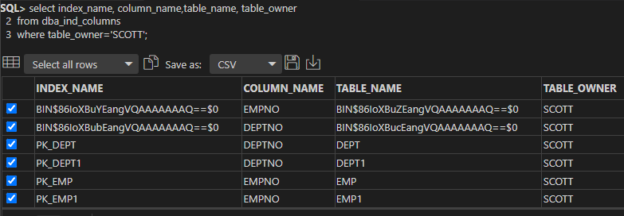
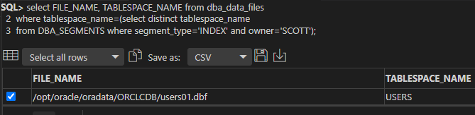
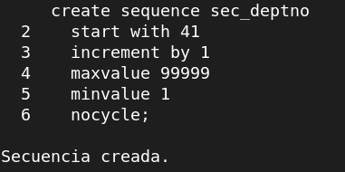
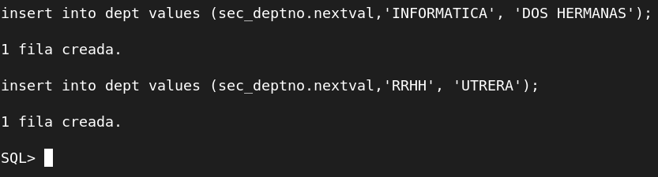
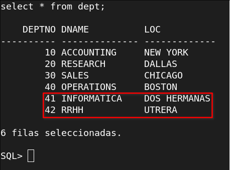
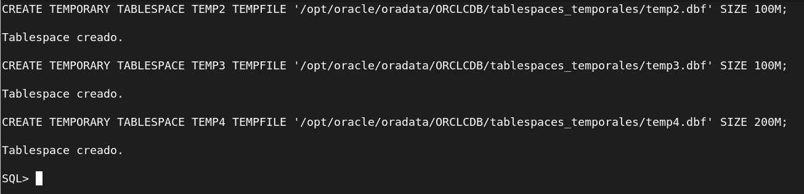
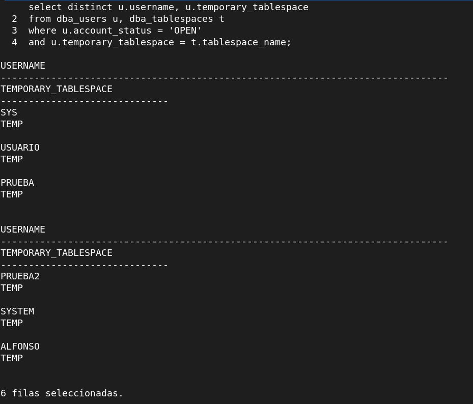
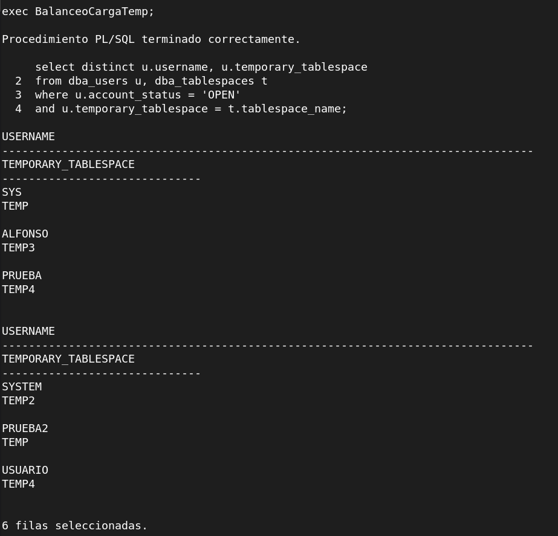

## Ejercicio 2:

**Realizad una consulta al diccionario de datos que muestre qué índices existen para objetos pertenecientes al esquema de SCOTT y sobre qué columnas están definidos.**

```sql
select index_name, column_name,table_name, table_owner
from dba_ind_columns
where table_owner='SCOTT';
```



**Averiguad en qué fichero o ficheros de datos se encuentran las extensiones de sus segmentos correspondientes.**

```sql
select FILE_NAME, TABLESPACE_NAME from dba_data_files 
where tablespace_name=(select distinct tablespace_name 
from DBA_SEGMENTS where segment_type='INDEX' and owner='SCOTT');
```



## Ejercicio 3:

##### Comprobamos el valor máximo de deptno:

```sql
select max(deptno) from dept;
```

##### Crear la secuencia 
(Inicializando el valor obtenido en la consulta anterior, en este caso 40):

```sql
create sequence sec_deptno
  start with 41
  increment by 1
  maxvalue 99999
  minvalue 1
  nocycle;
```

Comprobación:



Definición de parámetros empleados:


- La cláusula **"start with"** indica el valor desde el cual comenzará la generación de números secuenciales. Si no se especifica, se inicia con el valor que indique **"minvalue"**.

- La cláusula **"increment by"** especifica el incremento, es decir, la diferencia entre los números de la secuencia; debe ser un valor numérico entero positivo o negativo diferente de **0**. Si no se indica, por defecto es **1**. En este caso voy incrementar este valor en **1**, aunque podría hacerlo incrementándolo en **10**, como viene por defecto en el esquema SCOTT.

- Con **"maxvalue"** definimos el valor máximo para la secuencia. Si se omite, por defecto es **99999999999999999999999999**.

- Con **"minvalue"** establece el valor mínimo de la secuencia. Si se omite será **1**.

- La cláusula **"cycle"** indica que, cuando la secuencia llegue a máximo valor (valor de **"maxvalue"**) se reinicie, comenzando con el mínimo valor (**"minvalue"**) nuevamente, es decir, la secuencia vuelve a utilizar los números. Si se omite, por defecto la secuencia se crea **"nocycle"**. 

##### Insercción de datos utilizando la sencuencia:

```sql
insert into dept values (sec_deptno.nextval,'INFORMATICA', 'DOS HERMANAS');
```

Comprobación:





Definición de nextval y currval:

Mediante las pseudocolumnas **"currval"** y **"nextval"** podemos recuperar los valores de una secuencia.

Primero debemos incializar la secuencia con **"nextval"**. La primera vez que se usa **"nextval"** retorna el valor de inicio de la secuencia. Las siguientes veces, incrementa la secuencia y nos retorna el nuevo valor:

**NOMBRESECUENCIA.NEXTVAL;**

Como vemos, se coloca el nombre de la secuencia seguido de un punto y la pseudocolumna **"nextval"** (que es una forma abreviada de "next value", siguiente valor).

Para recuperar el valor actual de una secuencia usamos:

 **NOMBRESECUENCIA.CURRVAL;**

 Como vemos es símilar a **nextval**, solo que **"currval"** es una forma abreviada de **"current value"**, es decir, valor actual.


## Ejercicio 6:

Antes que nada, para poder realizar este ejercicio comenzaremos creando tablespaces temporales y usuarios:

**Creamos los usuarios:**

```
alter session set "_ORACLE_SCRIPT"=true;

CREATE USER usuario identified by usuario;
CREATE USER prueba identified by prueba;
CREATE USER prueba2 identified by prueba2;
```

Para **crear tablespaces temporales** nuevos usamos la siguiente sentencia (La ruta es opcional, pero debe tener como propietario al usuario oracle):

```
CREATE TEMPORARY TABLESPACE NOMBRE_TABLESPACE TEMPFILE '/opt/oracle/oradata/ORCLCDB/tablespaces_temporales/nombre_tablespace.dbf' SIZE 100M;
```




#### Procedimiento Principal

```sql
CREATE or REPLACE PROCEDURE BalanceoCargaTemp
is
begin
    if contar_tablespaces > contar_usuarios then
        
        BalanceoCargaTablespaces;
    else
        BalanceoCargaUsuarios;
    end if;
end;
/
```

#### Procedimientos y funciones dependientes (Compilar antes del procedimiento principal)


* **AsignarUsuarioTablespace**: Este procedimiento asociará al usuario en cuestión con el tablespace correspondiente mediante la instrucción ALTER USER.

```sql
CREATE or REPLACE PROCEDURE AsignarUsuarioTablespace (p_usuario dba_users.username%type, p_tablespace dba_tablespaces.tablespace_name%type)
IS
BEGIN
    execute immediate 'alter user ' || p_usuario || ' temporary tablespace ' || p_tablespace;
END;
/
```


* **BalanceoCargaTablespaces**: Este procedimiento se ejecutará en caso de que haya más tablespaces temporales que usuarios. Este procedimiento contará con 2 cursores. El cursor c_tablespaces_temporales será recorrido con un bucle for en base cada uno de los tablespaces temporales existentes y a su vez dentro del bucle, se recorrerá el cursor c_usuarios, el cual se encargará de asignar a los usuarios al tablespace correspondiente a la vuelta del bucle principal. Una vez termina el cursor de los usuarios, se reinicia para pasar al siguiente usuario.

```sql
CREATE or REPLACE PROCEDURE BalanceoCargaTablespaces
IS
	cursor c_usuarios is
	  select distinct u.username
    from dba_users u, dba_tablespaces t
    where u.account_status = 'OPEN'
    and u.temporary_tablespace = t.tablespace_name;
  cursor c_tablespaces_temporales is
    SELECT tablespace_name
    FROM dba_tablespaces
    WHERE contents = 'TEMPORARY'
    and status = 'ONLINE';
  v_usuarios c_usuarios%rowtype;
BEGIN
    open c_usuarios;
    for v_tablespace in c_tablespaces_temporales loop
        fetch c_usuarios into v_usuarios;
        AsignarUsuarioTablespace (v_usuarios.username, v_tablespace.tablespace_name);
        if c_tablespaces_temporales%NOTFOUND then
          close c_usuarios;
          open c_usuarios;
        end if;
    end loop;
end;
/
```

* **BalanceoCargaUsuarios**: Procedimiento que funcionará de la misma forma que el procedimiento principal (BalancearCargaTablespaces), solo que realizará el bucle principal en base a los usuarios, reinciando en cada vuelta del bucle principal (De los usuarios) el cursor de los tablespaces temporales existentes.

```sql
CREATE or REPLACE PROCEDURE BalanceoCargaUsuarios
IS
	cursor c_usuarios is
	  select distinct u.username
    from dba_users u, v$TEMP_SPACE_HEADER t
    where u.account_status = 'OPEN'
    and u.temporary_tablespace = t.tablespace_name;
  cursor c_tablespaces_temporales
    is
    SELECT tablespace_name
    FROM dba_tablespaces
    WHERE contents = 'TEMPORARY'
    and status = 'ONLINE';
    v_tablespace c_tablespaces_temporales%rowtype;
BEGIN
    open c_tablespaces_temporales;
    for v_usuario in c_usuarios loop
        fetch c_tablespaces_temporales into v_tablespace;
        AsignarUsuarioTablespace (v_usuario.username, v_tablespace.tablespace_name);
        if c_tablespaces_temporales%NOTFOUND then
          close c_tablespaces_temporales;
          open c_tablespaces_temporales;
        end if;
    end loop;
END;
/
```

* **contar_usuarios**: Función que nos devolverá la cantidad de usuarios.

```sql
CREATE or REPLACE FUNCTION contar_usuarios
return number
is
    v_numusers     number;
begin
    select count(u.username) into v_numusers
    from dba_users u, v$TEMP_SPACE_HEADER t
    where u.account_status = 'OPEN'
    and u.temporary_tablespace = t.tablespace_name;
    return v_numusers;
end;
/
```

* **contar_tablespaces**: Función que nos devolverá la cantidad de tablespaces temporales

```sql
CREATE or REPLACE FUNCTION contar_tablespaces
return number
is
    v_numts     number;
begin
    SELECT count(tablespace_name) into v_numts
    FROM dba_tablespaces
    WHERE contents = 'TEMPORARY'
    and lower(status) = 'online';
    return v_numts;
end;
/
```

#### Comprobación del funcionamiento

Con la siguiente consulta, podremos ver cada uno de los usuarios, junto con el tablespace temporal que tiene asignado:

```
select distinct u.username, u.temporary_tablespace
from dba_users u, dba_tablespaces t
where u.account_status = 'OPEN'
and u.temporary_tablespace = t.tablespace_name;
```

**Nota:** En lugar de la tabla *dba_tablespaces*, también podemos usar la vista **v$TEMP_SPACE_HEADER**.



Después de compilar todos los procedimientos y funciones, ejecutaremos el procedimiento principal (**BalanceoCargaTemp**) y volveremos a realizar la consulta anterior.



Como podemos comprobar se ha realizado correctamente el balanceo de la carga de usuarios entre cada uno de los tablespaces temporales existentes.

## Ejercicio 5:

**Meted las tablas EMP y DEPT de SCOTT en un cluster.**

```sql
CREATE TABLESPACE tablespacec1 
DATAFILE '/opt/oracle/oradata/ORCLCDB/cluster1.dbf' SIZE 1M AUTOEXTEND ON;

CREATE CLUSTER tablasempdept(DEPTNO NUMBER(2)) TABLESPACE tablespacec1;

CREATE INDEX INDEXNAME ON CLUSTER tablasempdept;

CREATE TABLE SCOTT.DEPT1
(
 DEPTNO NUMBER(2),
 DNAME VARCHAR2(14),
 LOC VARCHAR2(13),
 CONSTRAINT PK_DEPT1 PRIMARY KEY (DEPTNO))
 CLUSTER tablasempdept (DEPTNO);

CREATE TABLE SCOTT.EMP1
(
 EMPNO NUMBER(4),
 ENAME VARCHAR2(10),
 JOB VARCHAR2(9),
 MGR NUMBER(4),
 HIREDATE DATE,
 SAL NUMBER(7, 2),
 COMM NUMBER(7, 2),
 DEPTNO NUMBER(2),
 CONSTRAINT FK_DEPTNO1 FOREIGN KEY (DEPTNO) REFERENCES SCOTT.DEPT1 (DEPTNO),
 CONSTRAINT PK_EMP1 PRIMARY KEY (EMPNO)
)
 CLUSTER tablasempdept (DEPTNO);
```
