# Parte grupal:

## 1. Cread un índice para la tabla EMP de SCOTT que agilice las consultas por nombre de empleado en un tablespace creado específicamente para índices. ¿Dónde deberiáis ubicar el fichero de datos asociado? ¿Cómo se os ocurre que podriáis probar si el índice resulta de utilidad?

Modificamos la tabla emp para que admita 100.000 registros:
```sql
alter table scott.emp modify (empno number(5));
```

Primero voy a crear un procedimiento que me cree 100.000 registros en la tabla EMP de SCOTT:
```sql
CREATE OR REPLACE PROCEDURE add_100000_emp
AS
v_nombre scott.emp.ename%TYPE;
BEGIN
    FOR i IN 0..99999 LOOP
        v_nombre := 'e' || i;
        INSERT INTO scott.emp VALUES (i, v_nombre, 'CLERK', 7902, TO_DATE('01/01/1980', 'DD/MM/YYYY'), 1000, 1000 , 20);
    END LOOP;
END;
/
exec add_100000_emp;
```

Antes de ejecutar el procedimiento, voy a eliminar todo el contenido de la tabla EMP:
```sql
delete from scott.emp;
```

Vamos a comprobar el rendimiento de la búsqueda de un registro en la tabla EMP sin índice. Primero, vamos a activar el modo de depuración y el modo de traza de la sesión:
```sql
set serveroutput on
set autotrace on
```
Tras esto, ejecutamos la siguiente consulta:
```sql
select * from scott.emp where ename = 'e77777';
```
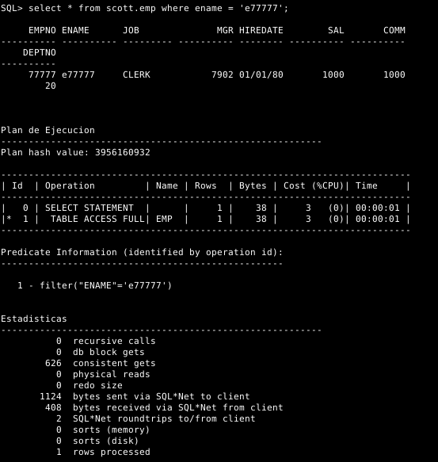

Ahora tenemos que crear un tablespace, por lo que debemos elegir qué datafiles vamos a asociarle. Por defecto estos ficheros se guardan en el directorio /opt/oracle/oradata/ORCLCDB/, pero en función de la frecuencia con la que utilicemos este índice, podríamos guardarlo en un dispositivo de bloques con mayor velocidad de lectura, como por ejemplo en un SSD. Vamos a suponer que tenemos un SSD (/dev/vdb), el cual formatearemos como ext4 y montaremos en /opt/oracle/oradata/ORCLCDB/ssd

Primero creamos el directorio y asignamos los permisos y propietario adecuados.
```bash
mkdir /opt/oracle/oradata/ORCLCDB/ssd
chown oracle: /opt/oracle/oradata/ORCLCDB/ssd
chmod 700 /opt/oracle/oradata/ORCLCDB/ssd
mkfs.ext4 /dev/vdb
```

Creamos una unidad de systemd en /etc/systemd/system/ para que se monte automáticamente al arrancar el sistema. Dicha unidad tendrá el siguiente contenido:
```bash
nano /etc/systemd/system/opt-oracle-oradata-ORCLCDB-ssd.mount

[Unit]
Description= SSD for Oracle indexes storaging purposes

[Mount]
What=/dev/vdb
Where=/opt/oracle/oradata/ORCLCDB/ssd
Type=ext4
Options=defaults

[Install]
WantedBy=multi-user.target
```

Para el montado automático al inicio del sistema, habilitamos el servicio.
```bash
systemctl daemon-reload
systemctl start opt-oracle-oradata-ORCLCDB-ssd.mount
systemctl enable opt-oracle-oradata-ORCLCDB-ssd.mount
```
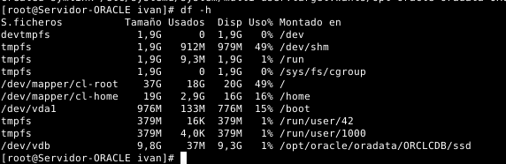

Para crear el tablespace, ejecutamos la siguiente instrucción:
```sql
create tablespace indices_emp datafile '/opt/oracle/oradata/ORCLCDB/ssd/indices_emp.dbf' size 10M autoextend on extent management local;
```
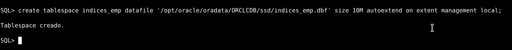

A continuación, creamos el índice:
```sql
CREATE INDEX nombres_empleados ON scott.emp(ename) TABLESPACE indices_emp;
```
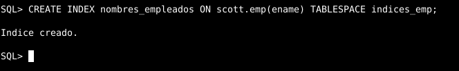

Comprobamos que el tablespace se ha creado correctamente:
```sql
select FILE_NAME, TABLESPACE_NAME from dba_data_files;
```
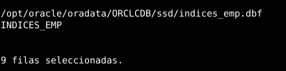

Comprobamos que el índice se ha creado correctamente:
```sql
select index_name, tablespace_name from dba_indexes where table_name = 'EMP';
```
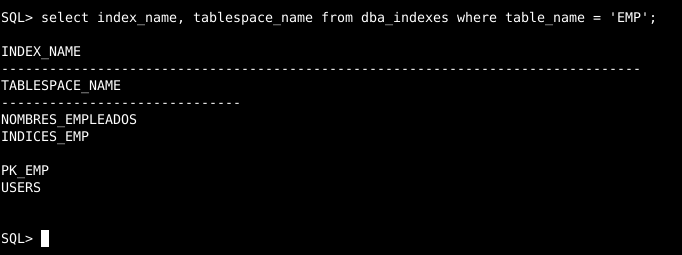

Vamos a comprobar el rendimiento de la búsqueda de un registro en la tabla EMP con índice:
```sql
set serveroutput on
set autotrace on
select * from scott.emp where ename = 'e77777';
```
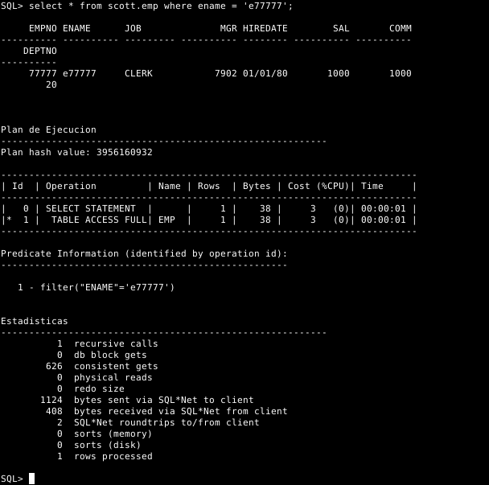

Para comprobar la utilidad de este índice, necesitaríamos que la tabla EMP tuviera aún muchos más registros. De esta manera, veríamos un aumento de rendimiento en comparación a no tener un índice definido. También, hay que tener en cuenta que es un escenario irreal.
También, el campo ename es un campo de tipo VARCHAR2, por lo que no consume mucho espacio en memoria. Si el campo fuera de tipo CHAR, el índice sería más útil, ya que el tamaño de los registros sería mayor debido a que CHAR rellena con espacios los campos que no ocupan todo el espacio reservado.

## Ejercicio 2:

**Realizad una consulta al diccionario de datos que muestre qué índices existen para objetos pertenecientes al esquema de SCOTT y sobre qué columnas están definidos.**

```sql
select index_name, column_name,table_name, table_owner
from dba_ind_columns
where table_owner='SCOTT';
```


**Averiguad en qué fichero o ficheros de datos se encuentran las extensiones de sus segmentos correspondientes.**

```sql
select FILE_NAME, TABLESPACE_NAME from dba_data_files 
where tablespace_name=(select distinct tablespace_name 
from DBA_SEGMENTS where segment_type='INDEX' and owner='SCOTT');
```


## Ejercicio 3:

##### Comprobamos el valor máximo de deptno:

```sql
select max(deptno) from dept;
```

##### Crear la secuencia 
(Inicializando el valor obtenido en la consulta anterior, en este caso 40):

```sql
create sequence sec_deptno
  start with 41
  increment by 1
  maxvalue 99999
  minvalue 1
  nocycle;
```

Comprobación:


Definición de parámetros empleados:


- La cláusula **"start with"** indica el valor desde el cual comenzará la generación de números secuenciales. Si no se especifica, se inicia con el valor que indique **"minvalue"**.

- La cláusula **"increment by"** especifica el incremento, es decir, la diferencia entre los números de la secuencia; debe ser un valor numérico entero positivo o negativo diferente de **0**. Si no se indica, por defecto es **1**. En este caso voy incrementar este valor en **1**, aunque podría hacerlo incrementándolo en **10**, como viene por defecto en el esquema SCOTT.

- Con **"maxvalue"** definimos el valor máximo para la secuencia. Si se omite, por defecto es **99999999999999999999999999**.

- Con **"minvalue"** establece el valor mínimo de la secuencia. Si se omite será **1**.

- La cláusula **"cycle"** indica que, cuando la secuencia llegue a máximo valor (valor de **"maxvalue"**) se reinicie, comenzando con el mínimo valor (**"minvalue"**) nuevamente, es decir, la secuencia vuelve a utilizar los números. Si se omite, por defecto la secuencia se crea **"nocycle"**. 

##### Insercción de datos utilizando la sencuencia:

```sql
insert into dept values (sec_deptno.nextval,'INFORMATICA', 'DOS HERMANAS');
```

Comprobación:


Definición de nextval y currval:

Mediante las pseudocolumnas **"currval"** y **"nextval"** podemos recuperar los valores de una secuencia.

Primero debemos incializar la secuencia con **"nextval"**. La primera vez que se usa **"nextval"** retorna el valor de inicio de la secuencia. Las siguientes veces, incrementa la secuencia y nos retorna el nuevo valor:

**NOMBRESECUENCIA.NEXTVAL;**

Como vemos, se coloca el nombre de la secuencia seguido de un punto y la pseudocolumna **"nextval"** (que es una forma abreviada de "next value", siguiente valor).

Para recuperar el valor actual de una secuencia usamos:

 **NOMBRESECUENCIA.CURRVAL;**

 Como vemos es símilar a **nextval**, solo que **"currval"** es una forma abreviada de **"current value"**, es decir, valor actual.

## 4. Queremos limpiar nuestro fichero tnsnames.ora. Averiguad cuales de sus entradas se están usando en algún enlace de la base de datos.

Antes de poder eliminar entradas inactivas en el archivo tnsnames.ora, es importante identificar cuáles entradas están siendo usadas por los enlaces activos existentes. Esto ayudará a asegurarse de que ninguna entrada esencial sea removida accidentalmente.

Para ello, usaremos el siguiente comando:
```sql
SELECT * FROM DBA_DB_LINKS;
```

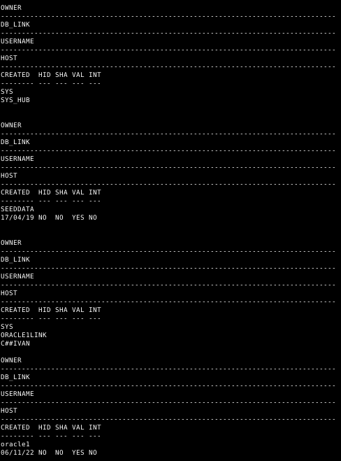

Es evidente que hay alguna línea de conexión que está utilizando la entrada oracle1, por lo tanto, no deberíamos eliminarla. Si hubiera más vínculos descritos, entonces podríamos suprimir esas sin preocuparnos de interrumpir alguna conexión, ya que no estaríamos borrando aquellas que estén siendo usadas.

Para borrar una entrada de tnsnames.ora, tendremos que localizar el fichero en la ruta especificada y modificarlo. La ruta al fichero puede variar dependiendo de la ubicación y el sistema operativo, por lo que tendremos que asegurarnos de dirigirnos a la ubicación correcta. Una vez allí, bastará con eliminar la línea asociada a la entrada que se desea borrar.

Pasemos a la acción. En primer lugar, localizamos el fichero tnsnames.ora:
```bash
find / -name tnsnames.ora | grep "tnsnames.ora"
```

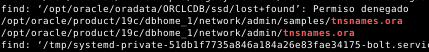

El que nos interesa es el que se encuentra en la ruta /opt/oracle/product/19c/dbhome_1/network/admin/tnsnames.ora.
Si abrimos el fichero, veremos que hay varias entradas:
```bash
nano /opt/oracle/product/19c/dbhome_1/network/admin/tnsnames.ora
```

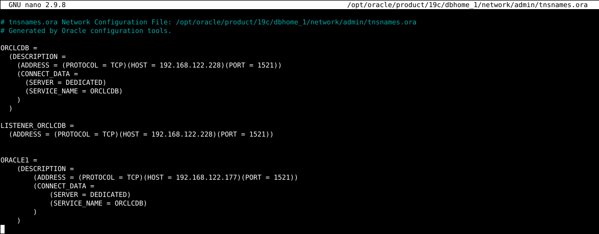


Ahora, procedemos a borrar la entrada oracle1 (no deberíamos hacerlo ya que está siendo usada pero lo haremos para el ejemplo):

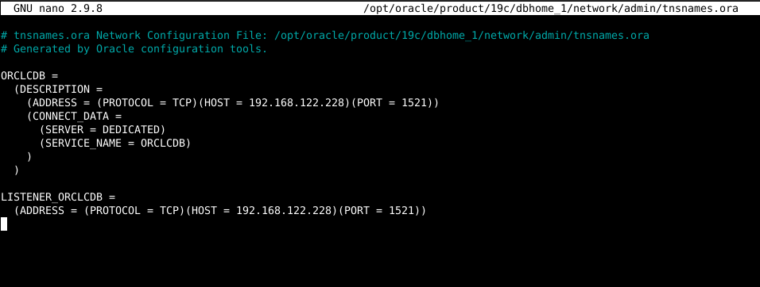

Tras editar el fichero, guardamos los cambios y reiniciamos el servicio de listener. La entrada oracle1 ya no aparecerá en la lista de entradas del fichero tnsnames.ora:
```bash
lsnrctl reload
```

## Ejercicio 6:

Antes que nada, para poder realizar este ejercicio comenzaremos creando tablespaces temporales y usuarios:

**Creamos los usuarios:**

```
alter session set "_ORACLE_SCRIPT"=true;

CREATE USER usuario identified by usuario;
CREATE USER prueba identified by prueba;
CREATE USER prueba2 identified by prueba2;
```

Para **crear tablespaces temporales** nuevos usamos la siguiente sentencia (La ruta es opcional, pero debe tener como propietario al usuario oracle):

```
CREATE TEMPORARY TABLESPACE NOMBRE_TABLESPACE TEMPFILE '/opt/oracle/oradata/ORCLCDB/tablespaces_temporales/nombre_tablespace.dbf' SIZE 100M;
```


#### Procedimiento Principal

```sql
CREATE or REPLACE PROCEDURE BalanceoCargaTemp
is
begin
    if contar_tablespaces > contar_usuarios then
        
        BalanceoCargaTablespaces;
    else
        BalanceoCargaUsuarios;
    end if;
end;
/
```

#### Procedimientos y funciones dependientes (Compilar antes del procedimiento principal)


* **AsignarUsuarioTablespace**: Este procedimiento asociará al usuario en cuestión con el tablespace correspondiente mediante la instrucción ALTER USER.

```sql
CREATE or REPLACE PROCEDURE AsignarUsuarioTablespace (p_usuario dba_users.username%type, p_tablespace dba_tablespaces.tablespace_name%type)
IS
BEGIN
    execute immediate 'alter user ' || p_usuario || ' temporary tablespace ' || p_tablespace;
END;
/
```


* **BalanceoCargaTablespaces**: Este procedimiento se ejecutará en caso de que haya más tablespaces temporales que usuarios. Este procedimiento contará con 2 cursores. El cursor c_tablespaces_temporales será recorrido con un bucle for en base cada uno de los tablespaces temporales existentes y a su vez dentro del bucle, se recorrerá el cursor c_usuarios, el cual se encargará de asignar a los usuarios al tablespace correspondiente a la vuelta del bucle principal. Una vez termina el cursor de los usuarios, se reinicia para pasar al siguiente usuario.

```sql
CREATE or REPLACE PROCEDURE BalanceoCargaTablespaces
IS
	cursor c_usuarios is
	  select distinct u.username
    from dba_users u, dba_tablespaces t
    where u.account_status = 'OPEN'
    and u.temporary_tablespace = t.tablespace_name;
  cursor c_tablespaces_temporales is
    SELECT tablespace_name
    FROM dba_tablespaces
    WHERE contents = 'TEMPORARY'
    and status = 'ONLINE';
  v_usuarios c_usuarios%rowtype;
BEGIN
    open c_usuarios;
    for v_tablespace in c_tablespaces_temporales loop
        fetch c_usuarios into v_usuarios;
        AsignarUsuarioTablespace (v_usuarios.username, v_tablespace.tablespace_name);
        if c_tablespaces_temporales%NOTFOUND then
          close c_usuarios;
          open c_usuarios;
        end if;
    end loop;
end;
/
```

* **BalanceoCargaUsuarios**: Procedimiento que funcionará de la misma forma que el procedimiento principal (BalancearCargaTablespaces), solo que realizará el bucle principal en base a los usuarios, reinciando en cada vuelta del bucle principal (De los usuarios) el cursor de los tablespaces temporales existentes.

```sql
CREATE or REPLACE PROCEDURE BalanceoCargaUsuarios
IS
	cursor c_usuarios is
	  select distinct u.username
    from dba_users u, v$TEMP_SPACE_HEADER t
    where u.account_status = 'OPEN'
    and u.temporary_tablespace = t.tablespace_name;
  cursor c_tablespaces_temporales
    is
    SELECT tablespace_name
    FROM dba_tablespaces
    WHERE contents = 'TEMPORARY'
    and status = 'ONLINE';
    v_tablespace c_tablespaces_temporales%rowtype;
BEGIN
    open c_tablespaces_temporales;
    for v_usuario in c_usuarios loop
        fetch c_tablespaces_temporales into v_tablespace;
        AsignarUsuarioTablespace (v_usuario.username, v_tablespace.tablespace_name);
        if c_tablespaces_temporales%NOTFOUND then
          close c_tablespaces_temporales;
          open c_tablespaces_temporales;
        end if;
    end loop;
END;
/
```

* **contar_usuarios**: Función que nos devolverá la cantidad de usuarios.

```sql
CREATE or REPLACE FUNCTION contar_usuarios
return number
is
    v_numusers     number;
begin
    select count(u.username) into v_numusers
    from dba_users u, v$TEMP_SPACE_HEADER t
    where u.account_status = 'OPEN'
    and u.temporary_tablespace = t.tablespace_name;
    return v_numusers;
end;
/
```

* **contar_tablespaces**: Función que nos devolverá la cantidad de tablespaces temporales

```sql
CREATE or REPLACE FUNCTION contar_tablespaces
return number
is
    v_numts     number;
begin
    SELECT count(tablespace_name) into v_numts
    FROM dba_tablespaces
    WHERE contents = 'TEMPORARY'
    and lower(status) = 'online';
    return v_numts;
end;
/
```

#### Comprobación del funcionamiento

Con la siguiente consulta, podremos ver cada uno de los usuarios, junto con el tablespace temporal que tiene asignado:

```
select distinct u.username, u.temporary_tablespace
from dba_users u, dba_tablespaces t
where u.account_status = 'OPEN'
and u.temporary_tablespace = t.tablespace_name;
```

**Nota:** En lugar de la tabla *dba_tablespaces*, también podemos usar la vista **v$TEMP_SPACE_HEADER**.


Después de compilar todos los procedimientos y funciones, ejecutaremos el procedimiento principal (**BalanceoCargaTemp**) y volveremos a realizar la consulta anterior.


Como podemos comprobar se ha realizado correctamente el balanceo de la carga de usuarios entre cada uno de los tablespaces temporales existentes.

## Ejercicio 5:

**Meted las tablas EMP y DEPT de SCOTT en un cluster.**

```sql
CREATE TABLESPACE tablespacec1 
DATAFILE '/opt/oracle/oradata/ORCLCDB/cluster1.dbf' SIZE 1M AUTOEXTEND ON;

CREATE CLUSTER tablasempdept(DEPTNO NUMBER(2)) TABLESPACE tablespacec1;

CREATE INDEX INDEXNAME ON CLUSTER tablasempdept;

CREATE TABLE SCOTT.DEPT1
(
 DEPTNO NUMBER(2),
 DNAME VARCHAR2(14),
 LOC VARCHAR2(13),
 CONSTRAINT PK_DEPT1 PRIMARY KEY (DEPTNO))
 CLUSTER tablasempdept (DEPTNO);

CREATE TABLE SCOTT.EMP1
(
 EMPNO NUMBER(4),
 ENAME VARCHAR2(10),
 JOB VARCHAR2(9),
 MGR NUMBER(4),
 HIREDATE DATE,
 SAL NUMBER(7, 2),
 COMM NUMBER(7, 2),
 DEPTNO NUMBER(2),
 CONSTRAINT FK_DEPTNO1 FOREIGN KEY (DEPTNO) REFERENCES SCOTT.DEPT1 (DEPTNO),
 CONSTRAINT PK_EMP1 PRIMARY KEY (EMPNO)
)
 CLUSTER tablasempdept (DEPTNO);
```

## 7. Explicad en qué consiste el sharding en MongoDB. Intentad montarlo.

El sharding en MongoDB es una técnica de partición de datos que diviede los datos de una base de datos en partes más pequeñas para mejorar el rendimiento y la escalabilidad de la base de datos. Esto se logra almacenando los datos en diferentes servidores o máquinas. Los datos se dividen en "shards" o trozos, para proporcionar una mejor distribución de los datos en todas las máquinas. Esto también permite que una base de datos sea capaz de manejar una carga de trabajo mucho mayor que una sola máquina. El sharding también ayuda a reducir los tiempos de respuesta al permitir que los datos se lean y escriban en múltiples servidores en paralelo.

Resumiendo, las ventajas del sharding son:

- Mejorar el rendimiento y la escalabilidad de la base de datos. 

- Permitir que una base de datos pueda manejar una carga de trabajo mucho mayor que una sola máquina.
 
- Reducir los tiempos de respuesta al permitir que los datos se lean y escriban en múltiples servidores en paralelo.

Una vez explicado el sharding, vamos a proceder a montarlo. Para ello, necesitaremos tener instalado MongoDB en varios equipos. En mi caso, lo tengo instalado en Linux. Para ello, vamos a seguir estos pasos:


1. **Configuración de la red:** configuramos los sistemas Linux para que estén conectados entre sí a través de la red, usando configuraciones estáticas IP.

2. **Instalación de MongoDB:** instalamos MongoDB en cada uno de los sistemas Linux.

3. **Configuración de los config servers:** configuramos los servidores de configuración (config servers) en el sistema Linux que los hospede. Configuramos la cadena de réplica de los servidores de configuración para que se sincronicen entre ellos.

4. **Configuración de los servidores query routers:** configuramos los servidores query routers en los sistemas Linux para que puedan acceder a los servidores de configuración.

5. **Configuración de los servidores de almacenamiento:** configuramos los servidores de almacenamiento (shards) en los sistemas Linux para que puedan acceder a los servidores query routers.

6. **Configuración del sharding:** usamos la herramienta mongo para configurar el sharding en los servidores de almacenamiento, indicando qué bases de datos y colecciones deben estar en cada uno.

7. **Prueba del sharding:** realizamos pruebas del sharding para asegurarnos de que todo está funcionando correctamente.
